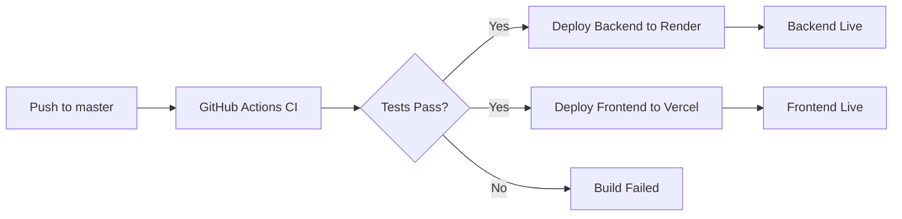

# 📦 Resumo da Configuração de Deploy

## ✅ O que foi configurado

### 🏗️ Arquivos de Configuração Criados

#### Backend (Render)
- ✅ `render.yaml` - Configuração declarativa do Render
- ✅ `backend/bin/render-build.sh` - Script de build para produção
- ✅ `backend/config/initializers/cors.rb` - CORS configurável por variável de ambiente
- ✅ `backend/config/routes.rb` - Health check endpoint adicionado

#### Frontend (Vercel)
- ✅ `frontend/vercel.json` - Configuração do Vercel com headers de segurança
- ✅ `frontend/.env.production` - Template de variáveis de ambiente para produção

#### CI/CD (GitHub Actions)
- ✅ `.github/workflows/ci.yml` - Integração contínua (testes + lint)
- ✅ `.github/workflows/deploy-backend.yml` - Deploy automático do backend
- ✅ `.github/workflows/deploy-frontend.yml` - Deploy automático do frontend

#### Documentação
- ✅ `.env.production.example` - Template de variáveis de ambiente
- ✅ `DEPLOYMENT_GUIDE.md` - Guia completo de deploy passo a passo
- ✅ `.gitignore` - Atualizado para ignorar arquivos sensíveis

## 🎯 Próximos Passos

### 1. Configurar Render (Backend)
```bash
# Gerar secrets necessários
cd backend
bundle exec rails secret  # Para SECRET_KEY_BASE
bundle exec rails secret  # Para JWT_SECRET_KEY
```

**Ações necessárias:**
1. Criar conta no Render
2. Criar PostgreSQL database
3. Criar Web Service
4. Adicionar variáveis de ambiente (veja DEPLOYMENT_GUIDE.md)
5. Fazer primeiro deploy manual

### 2. Configurar Vercel (Frontend)
```bash
# Login e link do projeto
cd frontend
vercel login
vercel link
```

**Ações necessárias:**
1. Criar conta na Vercel
2. Importar projeto do GitHub
3. Configurar variáveis de ambiente
4. Fazer primeiro deploy

### 3. Configurar GitHub Actions
**Secrets necessários no GitHub:**
```
RENDER_API_KEY          # Render Dashboard → Account Settings → API Keys
RENDER_SERVICE_ID       # URL do service: srv-xxxxx
VERCEL_TOKEN           # Vercel → Settings → Tokens
VERCEL_ORG_ID          # Arquivo .vercel/project.json
VERCEL_PROJECT_ID      # Arquivo .vercel/project.json
```

### 4. Atualizar URLs
Após ambos os deploys:
1. Copiar URL do backend Render
2. Atualizar `NEXT_PUBLIC_API_URL` na Vercel
3. Copiar URL do frontend Vercel
4. Atualizar `FRONTEND_URL` no Render

## 🔐 Variáveis de Ambiente

### Backend (Render)
```bash
RAILS_ENV=production
RAILS_LOG_TO_STDOUT=true
RAILS_SERVE_STATIC_FILES=true
RAILS_MAX_THREADS=5
DATABASE_URL=[Supabase connection string]
SECRET_KEY_BASE=[Gerar com rails secret]
JWT_SECRET_KEY=[Gerar com rails secret]
FRONTEND_URL=https://seu-app.vercel.app
```

**Como obter DATABASE_URL:**
1. Supabase Dashboard → Settings → Database
2. Connection String → URI
3. Substitua `[YOUR-PASSWORD]` pela senha do projeto
4. Use a URL com pooler: `pooler.supabase.com:6543`

### Frontend (Vercel)
```bash
NEXT_PUBLIC_API_URL=https://seu-backend.onrender.com/api/v1
NEXT_PUBLIC_APP_NAME=Finance App
NEXT_PUBLIC_APP_VERSION=1.0.0
NODE_ENV=production
```

## 🚀 Comandos Úteis

### Desenvolvimento Local
```bash
# Backend
cd backend
bundle install
rails db:create db:migrate
rails server -p 3001

# Frontend
cd frontend
npm install
npm run dev
```

### Deploy Manual
```bash
# Backend (pelo Render Dashboard)
# Ou trigger via webhook

# Frontend
cd frontend
vercel --prod
```

### Testes
```bash
# Backend
cd backend
bundle exec rspec

# Frontend
cd frontend
npm run test:ci
npm run lint
npm run type-check
```

## 📊 Monitoramento

### Endpoints de Health Check
- Backend: `https://seu-app.onrender.com/health`
- Frontend: `https://seu-app.vercel.app` (página inicial)

### Logs
- **Render**: Dashboard → Service → Logs
- **Vercel**: Dashboard → Project → Deployments → Function Logs
- **GitHub Actions**: Repository → Actions tab

## 🔄 Fluxo de Deploy Automático



## ⚠️ Limitações do Free Tier

### Render Free
- Database: 1GB storage
- Web Service: Dorme após 15 min de inatividade
- 750 horas/mês de runtime
- Build time: 500 min/mês

### Vercel Free
- 100 GB bandwidth/mês
- 6000 minutos de build/mês
- Deployments ilimitados
- Domínio customizado: 1 por projeto

## 🐛 Troubleshooting Rápido

### Backend não inicia
```bash
# Verificar logs no Render
# Comum: DATABASE_URL não configurada ou SECRET_KEY_BASE faltando
```

### Frontend não conecta
```bash
# Verificar NEXT_PUBLIC_API_URL na Vercel
# Verificar CORS no backend
# Testar endpoint direto: curl https://backend.onrender.com/health
```

### GitHub Actions falha
```bash
# Verificar secrets do GitHub
# Ver logs da action específica
# Rodar testes localmente primeiro
```

## 📚 Referências Rápidas

- 📖 [Guia Completo](./DEPLOYMENT_GUIDE.md)
- 🔧 [Variáveis de Ambiente](./.env.production.example)
- 🏗️ [Render Config](./render.yaml)
- 🌐 [Vercel Config](./frontend/vercel.json)

## ✨ Melhorias Futuras (Opcional)

- [ ] Configurar domínio customizado
- [ ] Adicionar monitoring (Sentry, LogRocket)
- [ ] Configurar CDN para assets
- [ ] Implementar preview deployments
- [ ] Adicionar E2E tests no CI
- [ ] Configurar staging environment
- [ ] Implementar feature flags
- [ ] Adicionar performance monitoring

---

**Pronto para deploy!** 🎉

Siga o [DEPLOYMENT_GUIDE.md](./DEPLOYMENT_GUIDE.md) para instruções detalhadas passo a passo.
