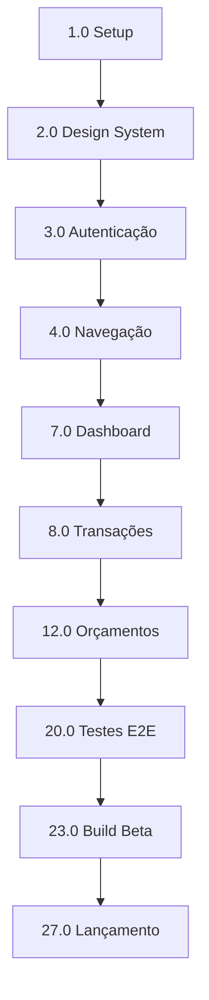

# Implementação Mobile App MVP - Resumo de Tarefas

**Projeto:** Aplicativo Mobile de Controle Financeiro Pessoal
**Versão:** 1.0
**Data de Criação:** 2025-11-10
**Status:** Em Planejamento

---

## 📊 Visão Geral

Este documento organiza as **27 tarefas principais** necessárias para a implementação completa do MVP do aplicativo mobile, conforme especificado no [PRD](../prd.md) e detalhado na [Tech Spec](../tech-spec.md).

### Estatísticas do Projeto

- **Total de Tarefas Principais:** 27
- **Total Estimado de Subtarefas:** ~280
- **Duração Estimada:** 12-14 semanas (3 sprints principais)
- **Cobertura de Testes:** Mínimo 70%

---

## 🎯 Tarefas por Sprint

### Sprint 1: Fundação e Infraestrutura (Semanas 1-4)

#### **Setup e Configuração Inicial**
- [ ] 1.0 - Setup do Projeto e Ambiente de Desenvolvimento
- [ ] 2.0 - Implementação do Design System
- [ ] 6.0 - Infraestrutura de Testes

#### **Autenticação e Navegação**
- [ ] 3.0 - Sistema de Autenticação
- [ ] 4.0 - Estrutura de Navegação
- [ ] 5.0 - Fluxo de Onboarding

---

### Sprint 2: Funcionalidades Core (Semanas 5-8)

#### **Funcionalidades Principais**
- [ ] 7.0 - Tela de Dashboard
- [ ] 8.0 - Gerenciamento de Transações
- [ ] 9.0 - Gerenciamento de Contas
- [ ] 10.0 - Sistema de Categorias
- [ ] 11.0 - Componentes de Gráficos

#### **Features Intermediárias**
- [ ] 12.0 - Sistema de Orçamentos
- [ ] 13.0 - Telas de Relatórios
- [ ] 14.0 - Filtros e Busca Avançada

---

### Sprint 3: Complementos e Polimento (Semanas 9-12)

#### **Funcionalidades Secundárias**
- [ ] 15.0 - Tela de Perfil e Configurações
- [ ] 16.0 - Sistema de Notificações
- [ ] 17.0 - Tema Escuro e Acessibilidade
- [ ] 18.0 - Otimização de Performance

#### **Persistência e Testes**
- [ ] 19.0 - Sistema de Cache e Persistência
- [ ] 20.0 - Testes E2E com Detox
- [ ] 21.0 - Testes em Dispositivos Reais

---

### Sprint 4: Preparação para Lançamento (Semanas 13-14)

#### **Quality Assurance e Deploy**
- [ ] 22.0 - Code Review e Refatoração
- [ ] 23.0 - Build e Configuração de Beta
- [ ] 24.0 - Coleta de Feedback Beta

#### **Publicação**
- [ ] 25.0 - Preparação de Assets para Stores
- [ ] 26.0 - Configuração de Monitoramento e Analytics
- [ ] 27.0 - Lançamento nas Stores

---

## 🔗 Matriz de Dependências

### Caminho Crítico (Sequencial)



### Tarefas Paraleláveis

Após **1.0 Setup** estar completo:
- 2.0, 6.0 podem iniciar em paralelo

Após **4.0 Navegação** estar completa:
- 5.0, 7.0 podem iniciar em paralelo

Após **7.0 Dashboard** estar completo:
- 8.0, 9.0, 10.0, 11.0 podem iniciar em paralelo

Após **8.0 Transações** estar completo:
- 12.0, 13.0, 14.0 podem iniciar em paralelo

Após **Sprint 2** estar completo:
- 15.0, 16.0, 17.0, 18.0, 19.0 podem iniciar em paralelo

---

## 📋 Lista Completa de Tarefas

### 1. Setup e Infraestrutura

| ID | Tarefa | Prioridade | Estimativa | Status | Bloqueios |
|----|--------|------------|------------|--------|-----------|
| 1.0 | Setup do Projeto e Ambiente | P0 | 3 dias | ⏳ Pendente | - |
| 2.0 | Design System | P0 | 3 dias | ⏳ Pendente | 1.0 |
| 6.0 | Infraestrutura de Testes | P0 | 2 dias | ⏳ Pendente | 1.0 |

### 2. Autenticação e Navegação

| ID | Tarefa | Prioridade | Estimativa | Status | Bloqueios |
|----|--------|------------|------------|--------|-----------|
| 3.0 | Sistema de Autenticação | P0 | 4 dias | ⏳ Pendente | 2.0 |
| 4.0 | Estrutura de Navegação | P0 | 2 dias | ⏳ Pendente | 3.0 |
| 5.0 | Fluxo de Onboarding | P0 | 3 dias | ⏳ Pendente | 4.0 |

### 3. Funcionalidades Core

| ID | Tarefa | Prioridade | Estimativa | Status | Bloqueios |
|----|--------|------------|------------|--------|-----------|
| 7.0 | Dashboard Principal | P0 | 4 dias | ⏳ Pendente | 4.0 |
| 8.0 | Gerenciamento de Transações | P0 | 5 dias | ⏳ Pendente | 7.0, 9.0, 10.0 |
| 9.0 | Gerenciamento de Contas | P0 | 3 dias | ⏳ Pendente | 7.0 |
| 10.0 | Sistema de Categorias | P0 | 3 dias | ⏳ Pendente | 7.0 |
| 11.0 | Componentes de Gráficos | P0 | 4 dias | ⏳ Pendente | 2.0 |

### 4. Features Intermediárias

| ID | Tarefa | Prioridade | Estimativa | Status | Bloqueios |
|----|--------|------------|------------|--------|-----------|
| 12.0 | Sistema de Orçamentos | P1 | 4 dias | ⏳ Pendente | 8.0, 10.0 |
| 13.0 | Telas de Relatórios | P1 | 4 dias | ⏳ Pendente | 8.0, 11.0 |
| 14.0 | Filtros e Busca | P1 | 3 dias | ⏳ Pendente | 8.0 |

### 5. Complementos

| ID | Tarefa | Prioridade | Estimativa | Status | Bloqueios |
|----|--------|------------|------------|--------|-----------|
| 15.0 | Perfil e Configurações | P2 | 3 dias | ⏳ Pendente | 3.0 |
| 16.0 | Sistema de Notificações | P2 | 2 dias | ⏳ Pendente | 8.0 |
| 17.0 | Tema Escuro e Acessibilidade | P2 | 3 dias | ⏳ Pendente | 2.0 |
| 18.0 | Otimização de Performance | P1 | 3 dias | ⏳ Pendente | 8.0, 13.0 |
| 19.0 | Cache e Persistência | P1 | 3 dias | ⏳ Pendente | 8.0 |

### 6. Testes e QA

| ID | Tarefa | Prioridade | Estimativa | Status | Bloqueios |
|----|--------|------------|------------|--------|-----------|
| 20.0 | Testes E2E com Detox | P0 | 4 dias | ⏳ Pendente | 8.0, 12.0 |
| 21.0 | Testes em Dispositivos Reais | P0 | 3 dias | ⏳ Pendente | 20.0 |
| 22.0 | Code Review e Refatoração | P1 | 3 dias | ⏳ Pendente | 21.0 |

### 7. Deploy e Lançamento

| ID | Tarefa | Prioridade | Estimativa | Status | Bloqueios |
|----|--------|------------|------------|--------|-----------|
| 23.0 | Build e Config de Beta | P0 | 2 dias | ⏳ Pendente | 22.0 |
| 24.0 | Coleta de Feedback Beta | P0 | 5 dias | ⏳ Pendente | 23.0 |
| 25.0 | Assets para Stores | P0 | 2 dias | ⏳ Pendente | 24.0 |
| 26.0 | Monitoramento e Analytics | P0 | 2 dias | ⏳ Pendente | 23.0 |
| 27.0 | Lançamento nas Stores | P0 | 3 dias | ⏳ Pendente | 25.0, 26.0 |

---

## 🎨 Legenda

### Prioridades
- **P0:** Crítica - Bloqueador para MVP
- **P1:** Alta - Importante para MVP
- **P2:** Média - Desejável para MVP

### Status
- ⏳ **Pendente** - Não iniciada
- 🔄 **Em Progresso** - Desenvolvimento ativo
- ✅ **Concluída** - Implementada e testada
- 🚫 **Bloqueada** - Aguardando dependências
- ⚠️ **Em Revisão** - Code review ou QA

### Estimativas
- **XS:** < 1 dia
- **S:** 1-2 dias
- **M:** 2-3 dias
- **L:** 3-5 dias
- **XL:** 5+ dias

---

## 📈 Progresso Geral

```
Sprint 1: [░░░░░░░░░░░░░░░░░░░░] 0% (0/6 tarefas)
Sprint 2: [░░░░░░░░░░░░░░░░░░░░] 0% (0/9 tarefas)
Sprint 3: [░░░░░░░░░░░░░░░░░░░░] 0% (0/8 tarefas)
Sprint 4: [░░░░░░░░░░░░░░░░░░░░] 0% (0/4 tarefas)

TOTAL: [░░░░░░░░░░░░░░░░░░░░] 0% (0/27 tarefas)
```

---

## 🔍 Como Usar Este Documento

1. **Para Desenvolvedores:**
   - Consulte a matriz de dependências antes de iniciar uma tarefa
   - Marque tarefas como "Em Progresso" ao começar
   - Atualize o status ao concluir
   - Veja os arquivos individuais (1.0_setup-projeto.md, etc.) para detalhes

2. **Para Project Managers:**
   - Acompanhe o progresso geral
   - Identifique bloqueios no caminho crítico
   - Monitore tarefas paralelas para otimizar recursos

3. **Para QA:**
   - Focque nas tarefas 20.0, 21.0, 22.0
   - Valide critérios de sucesso em cada tarefa
   - Reporte bugs diretamente nas issues das tarefas

---

## 📚 Referências

- **PRD:** [prd.md](../prd.md)
- **Tech Spec:** [tech-spec.md](../tech-spec.md)
- **Documentação Mobile:** [architectural-mobile.md](/Users/thiagocardoso/Documents/finance-app/architectural-mobile.md)
- **Tarefas Individuais:** Consulte os arquivos `X.0_nome-tarefa.md` nesta pasta

---

## 📝 Notas de Atualização

- **2025-11-10:** Criação inicial do documento de tarefas
- Atualizações futuras serão registradas aqui

---

**Gerado com apoio de Claude Code**
**Última atualização:** 2025-11-10
