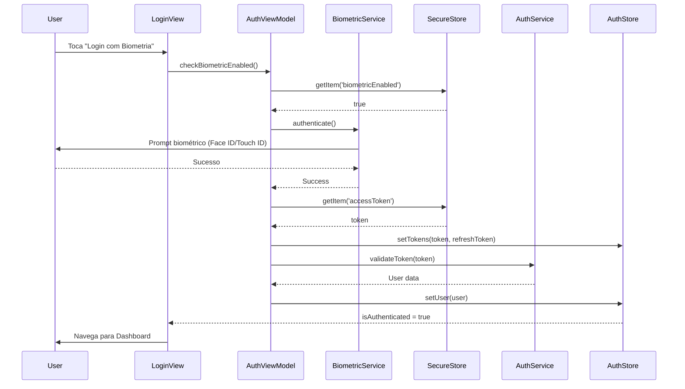
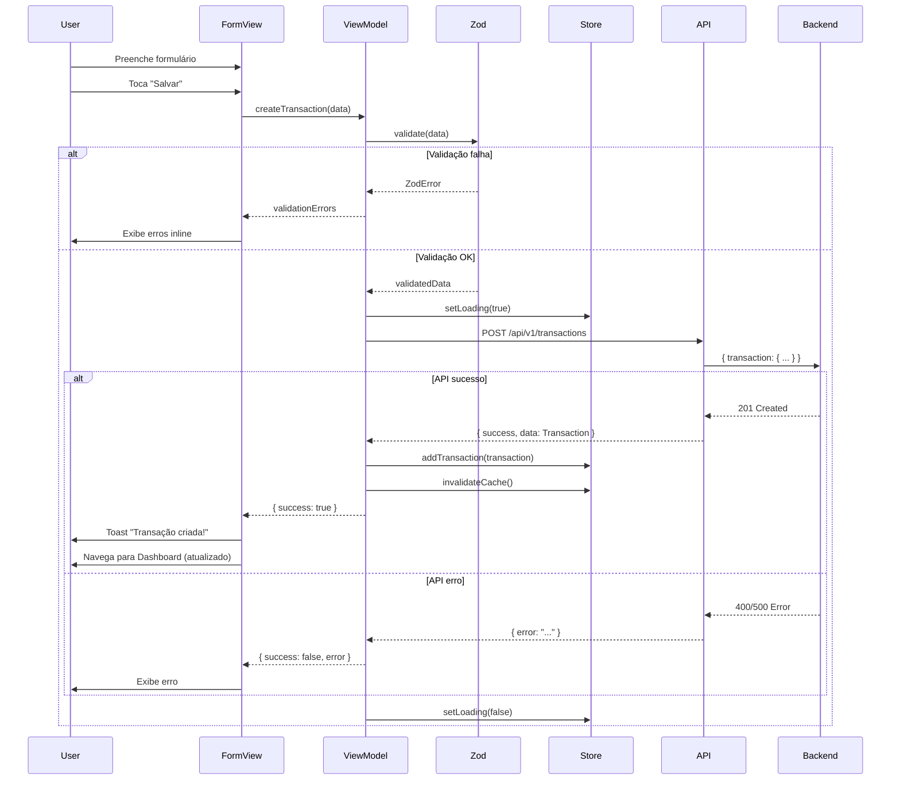
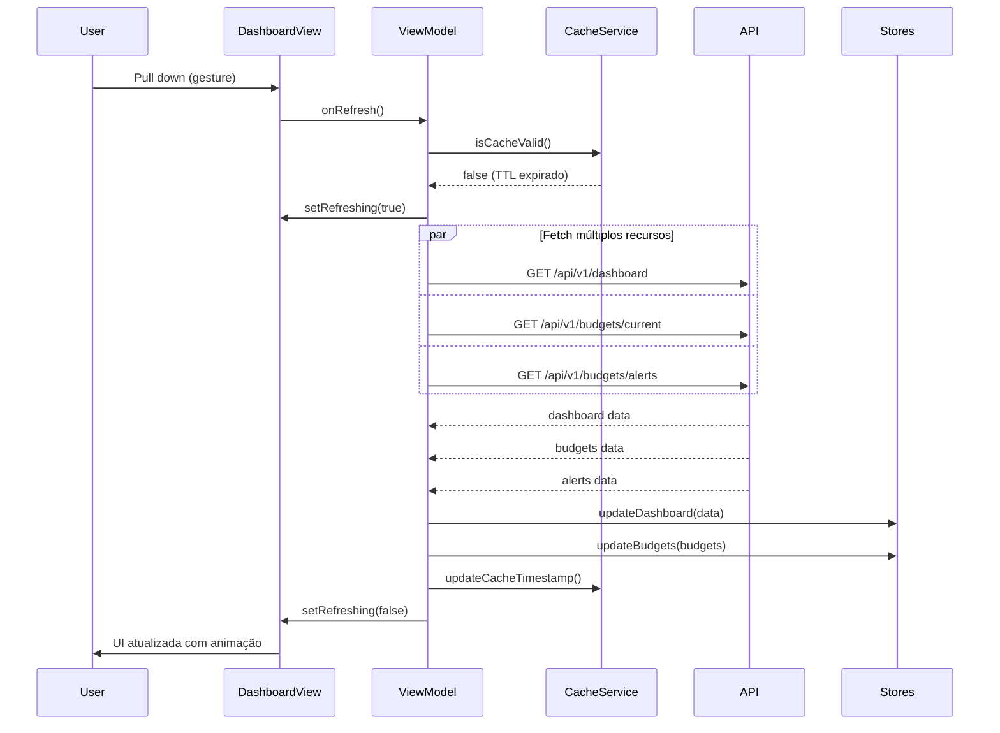
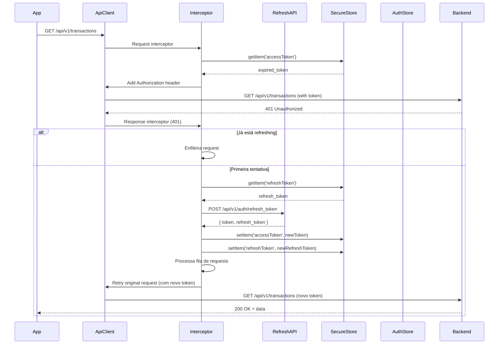

# Tech Spec: Aplicativo Mobile de Controle Financeiro Pessoal (MVP)

**Versão:** 1.0
**Data:** 2025-11-10
**Autor:** Thiago Cardoso (com apoio de Claude Code)
**Status:** Aprovado para Implementação
**PRD Relacionado:** [prd.md](./prd.md)

---

## 1. Visão Geral da Arquitetura

### 1.1 Stack Tecnológica Confirmada

```
┌─────────────────────────────────────────────────────────────┐
│                    APLICATIVO MOBILE MVP                     │
├─────────────────────────────────────────────────────────────┤
│ React Native 0.82.0 + Expo SDK 54.0.0 + TypeScript 5.3+    │
│ NativeWind 4.2.0 (Tailwind CSS para RN)                    │
│ Zustand (State Management) + React Hook Form + Zod         │
└─────────────────────────────────────────────────────────────┘
                           ↕ HTTPS/REST
┌─────────────────────────────────────────────────────────────┐
│               BACKEND RAILS EXISTENTE (API v1)              │
├─────────────────────────────────────────────────────────────┤
│ Rails 8.x + PostgreSQL                   │
│ JWT Authentication + JSON:API compliant                     │
│ Endpoints: /api/v1/*                                        │
└─────────────────────────────────────────────────────────────┘
```

### 1.2 Decisões Arquiteturais Principais

| Decisão | Escolha | Justificativa |
|---------|---------|---------------|
| **Padrão Arquitetural** | MVVM (Model-View-ViewModel) | Separação clara de responsabilidades, testabilidade, facilita manutenção |
| **Persistência Local** | AsyncStorage + Expo SecureStore | AsyncStorage para preferências/cache, SecureStore para tokens JWT (criptografado) |
| **Banco de Dados Local** | **NÃO usar SQLite para dados de negócio** | API Rails é fonte única de verdade. SQLite apenas para cache opcional futuro |
| **State Management** | Zustand | Leve, performático, API simples, melhor que Context para estado complexo |
| **Navegação** | React Navigation 6.x | Padrão da comunidade RN, suporte a deep linking, animações nativas |
| **Validação** | Zod | Consistência com frontend web, type-safety, schemas reutilizáveis |
| **Gráficos** | Victory Native | Performance nativa, suporte a animações, estilo customizável |
| **HTTP Client** | Axios | Interceptors para JWT refresh, retry logic, request cancellation |
| **Notificações** | Expo Notifications | Integrado ao Expo, simples de configurar, suporta local + remote |
| **Offline Support** | **Modo read-only no MVP** | Cache in-memory via Zustand, sem sincronização bidirecional (pós-MVP) |

### 1.3 Arquitetura MVVM em Camadas

```
┌──────────────────────────────────────────────────────────────┐
│                        VIEW LAYER                             │
│  (app/*/**.view.tsx - Telas e componentes visuais)          │
│  - Renderização UI                                           │
│  - Eventos de usuário (onPress, onChange)                    │
│  - Navegação entre telas                                     │
└──────────────────────────────────────────────────────────────┘
                          ↕ Props/Callbacks
┌──────────────────────────────────────────────────────────────┐
│                    VIEWMODEL LAYER                            │
│  (viewModels/use*.viewModel.ts - Lógica de apresentação)    │
│  - Custom hooks (useAuth, useDashboard, etc.)                │
│  - Transformação de dados (API → UI)                         │
│  - Validação de formulários (Zod)                            │
│  - Gestão de estado local (loading, errors)                  │
└──────────────────────────────────────────────────────────────┘
                          ↕ Métodos de serviço
┌──────────────────────────────────────────────────────────────┐
│                      SERVICE LAYER                            │
│  (shared/services/**/*.service.ts - Lógica de negócio)      │
│  - API calls (auth.service, transactions.service)            │
│  - Persistência local (storage.service)                      │
│  - Lógica de sincronização/cache                             │
│  - Error handling e retry logic                              │
└──────────────────────────────────────────────────────────────┘
                          ↕ HTTP/Storage
┌──────────────────────────────────────────────────────────────┐
│                       MODEL LAYER                             │
│  (shared/models/**/*.model.ts - Estruturas de dados)        │
│  - Interfaces TypeScript (User, Transaction, etc.)           │
│  - DTOs (Data Transfer Objects)                              │
│  - Schemas Zod para validação                                │
└──────────────────────────────────────────────────────────────┘
                          ↕ API REST
┌──────────────────────────────────────────────────────────────┐
│                    BACKEND RAILS API                          │
│  (Fonte única de verdade para dados de negócio)             │
└──────────────────────────────────────────────────────────────┘
```

---

## 2. Estrutura de Diretórios Detalhada

```
mobile/
├── src/
│   ├── app/                          # VIEW LAYER - Telas organizadas por feature
│   │   ├── auth/
│   │   │   ├── Login.view.tsx
│   │   │   ├── Register.view.tsx
│   │   │   ├── ForgotPassword.view.tsx
│   │   │   ├── Onboarding.view.tsx
│   │   │   └── components/           # Componentes específicos de auth
│   │   │       ├── BiometricPrompt.tsx
│   │   │       ├── OnboardingSlide.tsx
│   │   │       └── SocialLoginButtons.tsx
│   │   │
│   │   ├── dashboard/
│   │   │   ├── Dashboard.view.tsx
│   │   │   └── components/
│   │   │       ├── SummaryCard.tsx
│   │   │       ├── ExpenseChart.tsx
│   │   │       ├── BudgetProgress.tsx
│   │   │       └── RecentTransactionsList.tsx
│   │   │
│   │   ├── transactions/
│   │   │   ├── TransactionList.view.tsx
│   │   │   ├── TransactionForm.view.tsx
│   │   │   ├── TransactionDetail.view.tsx
│   │   │   └── components/
│   │   │       ├── TransactionItem.tsx
│   │   │       ├── CategorySelector.tsx
│   │   │       ├── AccountSelector.tsx
│   │   │       └── DatePicker.tsx
│   │   │
│   │   ├── accounts/
│   │   │   ├── AccountList.view.tsx
│   │   │   ├── AccountForm.view.tsx
│   │   │   └── components/
│   │   │       ├── AccountCard.tsx
│   │   │       └── AccountIconPicker.tsx
│   │   │
│   │   ├── categories/
│   │   │   ├── CategoryList.view.tsx
│   │   │   ├── CategoryForm.view.tsx
│   │   │   └── components/
│   │   │       ├── CategoryCard.tsx
│   │   │       ├── ColorPicker.tsx
│   │   │       └── IconPicker.tsx
│   │   │
│   │   ├── budgets/
│   │   │   ├── BudgetList.view.tsx
│   │   │   ├── BudgetForm.view.tsx
│   │   │   ├── BudgetDetail.view.tsx
│   │   │   └── components/
│   │   │       ├── BudgetProgressBar.tsx
│   │   │       └── BudgetAlert.tsx
│   │   │
│   │   ├── reports/
│   │   │   ├── Reports.view.tsx
│   │   │   └── components/
│   │   │       ├── MonthlyChart.tsx
│   │   │       ├── CategoryBreakdown.tsx
│   │   │       └── FilterBar.tsx
│   │   │
│   │   └── profile/
│   │       ├── Profile.view.tsx
│   │       ├── Settings.view.tsx
│   │       ├── ChangePassword.view.tsx
│   │       └── components/
│   │           ├── ThemeToggle.tsx
│   │           └── LanguageSelector.tsx
│   │
│   ├── viewModels/                   # VIEWMODEL LAYER - Lógica de apresentação
│   │   ├── useAuth.viewModel.ts
│   │   ├── useDashboard.viewModel.ts
│   │   ├── useTransaction.viewModel.ts
│   │   ├── useAccount.viewModel.ts
│   │   ├── useCategory.viewModel.ts
│   │   ├── useBudget.viewModel.ts
│   │   ├── useReport.viewModel.ts
│   │   └── useProfile.viewModel.ts
│   │
│   ├── shared/
│   │   ├── components/               # Componentes reutilizáveis (Design System)
│   │   │   ├── ui/
│   │   │   │   ├── Button/
│   │   │   │   │   ├── Button.tsx
│   │   │   │   │   └── Button.test.tsx
│   │   │   │   ├── Input/
│   │   │   │   │   ├── Input.tsx
│   │   │   │   │   ├── MoneyInput.tsx
│   │   │   │   │   └── Input.test.tsx
│   │   │   │   ├── Card/
│   │   │   │   │   ├── Card.tsx
│   │   │   │   │   └── Card.test.tsx
│   │   │   │   ├── Modal/
│   │   │   │   │   ├── Modal.tsx
│   │   │   │   │   ├── BottomSheet.tsx
│   │   │   │   │   └── Modal.test.tsx
│   │   │   │   ├── Select/
│   │   │   │   │   ├── Select.tsx
│   │   │   │   │   └── Select.test.tsx
│   │   │   │   ├── DatePicker/
│   │   │   │   │   ├── DatePicker.tsx
│   │   │   │   │   └── DatePicker.test.tsx
│   │   │   │   ├── Alert/
│   │   │   │   │   ├── Alert.tsx
│   │   │   │   │   └── Alert.test.tsx
│   │   │   │   ├── Badge/
│   │   │   │   │   └── Badge.tsx
│   │   │   │   ├── Skeleton/
│   │   │   │   │   └── Skeleton.tsx
│   │   │   │   └── FAB/
│   │   │   │       └── FAB.tsx
│   │   │   │
│   │   │   ├── charts/
│   │   │   │   ├── PieChart.tsx
│   │   │   │   ├── LineChart.tsx
│   │   │   │   ├── BarChart.tsx
│   │   │   │   └── AreaChart.tsx
│   │   │   │
│   │   │   └── layout/
│   │   │       ├── Screen.tsx         # Wrapper padrão para telas
│   │   │       ├── Header.tsx
│   │   │       └── EmptyState.tsx
│   │   │
│   │   ├── services/                 # SERVICE LAYER - API e persistência
│   │   │   ├── api/
│   │   │   │   ├── client.ts         # Configuração Axios + interceptors
│   │   │   │   ├── auth.service.ts
│   │   │   │   ├── transactions.service.ts
│   │   │   │   ├── accounts.service.ts
│   │   │   │   ├── categories.service.ts
│   │   │   │   ├── budgets.service.ts
│   │   │   │   ├── goals.service.ts
│   │   │   │   ├── dashboard.service.ts
│   │   │   │   └── analytics.service.ts
│   │   │   │
│   │   │   ├── storage/
│   │   │   │   ├── storage.service.ts    # AsyncStorage wrapper
│   │   │   │   ├── secureStorage.service.ts  # SecureStore wrapper
│   │   │   │   └── cache.service.ts      # Cache in-memory manager
│   │   │   │
│   │   │   └── notifications/
│   │   │       └── notifications.service.ts
│   │   │
│   │   ├── models/                   # MODEL LAYER - Tipos e schemas
│   │   │   ├── User.model.ts
│   │   │   ├── Transaction.model.ts
│   │   │   ├── Account.model.ts
│   │   │   ├── Category.model.ts
│   │   │   ├── Budget.model.ts
│   │   │   ├── Goal.model.ts
│   │   │   ├── Dashboard.model.ts
│   │   │   └── ApiResponse.model.ts
│   │   │
│   │   ├── schemas/                  # Schemas Zod para validação
│   │   │   ├── auth.schema.ts
│   │   │   ├── transaction.schema.ts
│   │   │   ├── account.schema.ts
│   │   │   ├── category.schema.ts
│   │   │   └── budget.schema.ts
│   │   │
│   │   ├── stores/                   # Zustand stores
│   │   │   ├── authStore.ts
│   │   │   ├── transactionsStore.ts
│   │   │   ├── accountsStore.ts
│   │   │   ├── categoriesStore.ts
│   │   │   ├── budgetsStore.ts
│   │   │   └── preferencesStore.ts
│   │   │
│   │   ├── hooks/                    # Custom hooks utilitários
│   │   │   ├── useDebounce.ts
│   │   │   ├── useInfiniteScroll.ts
│   │   │   ├── usePullToRefresh.ts
│   │   │   ├── useBiometric.ts
│   │   │   └── useTheme.ts
│   │   │
│   │   ├── utils/
│   │   │   ├── formatters.ts         # Formatação de moeda, datas
│   │   │   ├── validators.ts         # Validações customizadas
│   │   │   ├── dates.ts              # Helpers de data
│   │   │   ├── colors.ts             # Paleta e utilitários de cor
│   │   │   └── logger.ts             # Logger customizado (Sentry)
│   │   │
│   │   └── constants/
│   │       ├── colors.ts
│   │       ├── api.ts                # URLs, endpoints
│   │       ├── icons.ts              # Mapeamento de ícones
│   │       └── storage.ts            # Keys de storage
│   │
│   ├── routes/                       # Navegação
│   │   ├── index.tsx                 # Root navigator
│   │   ├── app.routes.tsx            # Rotas autenticadas (Bottom Tabs)
│   │   ├── auth.routes.tsx           # Rotas de autenticação (Stack)
│   │   └── types.ts                  # Tipos de navegação
│   │
│   ├── assets/
│   │   ├── images/
│   │   ├── icons/
│   │   └── fonts/
│   │
│   ├── config/
│   │   ├── theme.ts                  # Tema claro/escuro
│   │   └── env.ts                    # Variáveis de ambiente
│   │
│   └── App.tsx
│
├── __tests__/                        # Testes
│   ├── unit/
│   ├── integration/
│   └── e2e/
│
├── .env.example
├── .env.development
├── .env.production
├── app.json                          # Configuração Expo
├── eas.json                          # Configuração EAS Build
├── babel.config.js
├── metro.config.js
├── package.json
├── tailwind.config.js
└── tsconfig.json
```

---

## 3. Mapeamento Completo de Endpoints da API Rails

### 3.1 Base URL

```typescript
// config/api.ts
export const API_CONFIG = {
  BASE_URL: process.env.EXPO_PUBLIC_API_URL || 'https://api.finance-app.com',
  API_VERSION: 'v1',
  TIMEOUT: 30000, // 30s
  RETRY_ATTEMPTS: 3,
};

export const API_ENDPOINTS = {
  // Auth
  SIGN_UP: '/api/v1/auth/sign_up',
  SIGN_IN: '/api/v1/auth/sign_in',
  SIGN_OUT: '/api/v1/auth/sign_out',
  REFRESH_TOKEN: '/api/v1/auth/refresh_token',
  RESET_PASSWORD: '/api/v1/auth/reset_password',
  UPDATE_PASSWORD: '/api/v1/auth/update_password',
  CONFIRM_EMAIL: '/api/v1/auth/confirm_email',

  // Dashboard
  DASHBOARD: '/api/v1/dashboard',

  // Transactions
  TRANSACTIONS: '/api/v1/transactions',
  TRANSACTION_SUMMARY: '/api/v1/transactions/summary',
  TRANSACTION_SEARCH: '/api/v1/transactions/search',
  TRANSACTION_FILTER_OPTIONS: '/api/v1/transactions/filter_options',

  // Categories
  CATEGORIES: '/api/v1/categories',
  CATEGORY_STATISTICS: '/api/v1/categories/statistics',
  CATEGORY_TRANSACTIONS: (id: number) => `/api/v1/categories/${id}/transactions`,

  // Accounts
  ACCOUNTS: '/api/v1/accounts',
  ACCOUNT_BALANCE: (id: number) => `/api/v1/accounts/${id}/balance`,
  ACCOUNT_TRANSACTIONS: (id: number) => `/api/v1/accounts/${id}/transactions`,
  ACCOUNT_TRANSFER: '/api/v1/accounts/transfer',

  // Budgets
  BUDGETS: '/api/v1/budgets',
  BUDGET_CURRENT: '/api/v1/budgets/current',
  BUDGET_ALERTS: '/api/v1/budgets/alerts',

  // Goals
  GOALS: '/api/v1/goals',
  GOAL_CONTRIBUTIONS: (id: number) => `/api/v1/goals/${id}/contributions`,
  GOAL_UPDATE_PROGRESS: (id: number) => `/api/v1/goals/${id}/update_progress`,

  // Analytics
  ANALYTICS_FINANCIAL_SUMMARY: '/api/v1/analytics/financial_summary',
  ANALYTICS_BUDGET_PERFORMANCE: '/api/v1/analytics/budget_performance',

  // Health
  HEALTH: '/api/v1/health',
};
```

### 3.2 Detalhamento de Endpoints por Recurso

#### 3.2.1 Autenticação

| Método | Endpoint | Descrição | Request Body | Response |
|--------|----------|-----------|--------------|----------|
| `POST` | `/api/v1/auth/sign_up` | Cadastro de usuário | `{ user: { email, password, password_confirmation, first_name, last_name } }` | `{ success: true, data: { user, token, refresh_token }, message }` |
| `POST` | `/api/v1/auth/sign_in` | Login | `{ user: { email, password } }` | `{ success: true, data: { user, token, refresh_token }, message }` |
| `DELETE` | `/api/v1/auth/sign_out` | Logout | - | `{ success: true, message }` |
| `POST` | `/api/v1/auth/refresh_token` | Refresh JWT | `{ refresh_token }` | `{ success: true, data: { token, refresh_token }, message }` |
| `POST` | `/api/v1/auth/reset_password` | Solicitar reset de senha | `{ user: { email } }` | `{ success: true, message }` |
| `PUT` | `/api/v1/auth/update_password` | Atualizar senha | `{ user: { reset_password_token, password, password_confirmation } }` | `{ success: true, data: { user, token, refresh_token }, message }` |

**Headers Obrigatórios:**
```typescript
{
  'Content-Type': 'application/json',
  'Authorization': 'Bearer <access_token>', // Exceto sign_up, sign_in, refresh_token
}
```

**Estrutura do User:**
```typescript
interface User {
  id: number;
  email: string;
  first_name: string;
  last_name: string;
  confirmed_at: string | null;
}
```

#### 3.2.2 Dashboard

| Método | Endpoint | Descrição | Query Params | Response |
|--------|----------|-----------|--------------|----------|
| `GET` | `/api/v1/dashboard` | Dados consolidados do dashboard | `period?, start_date?, end_date?` | Ver estrutura abaixo |

**Response Dashboard:**
```typescript
{
  success: true,
  data: {
    summary: {
      total_balance: number,
      total_income: number,
      total_expenses: number,
      net_amount: number
    },
    transactions_summary: {
      total_count: number,
      income_count: number,
      expense_count: number
    },
    category_breakdown: Array<{
      category_id: number,
      category_name: string,
      category_color: string,
      category_icon: string,
      total_amount: number,
      transaction_count: number,
      percentage: number
    }>,
    recent_transactions: Transaction[], // Últimas 5
    budget_status: Array<{
      budget_id: number,
      category_name: string,
      limit_amount: number,
      spent_amount: number,
      percentage_used: number,
      status: 'ok' | 'warning' | 'exceeded'
    }>,
    chart_data: {
      daily_balance: Array<{ date: string, balance: number }>,
      monthly_trend: Array<{ month: string, income: number, expenses: number }>
    }
  }
}
```

**Parâmetros de Período:**
- `period`: 'this_month' | 'last_month' | 'this_year' | 'custom'
- `start_date`: 'YYYY-MM-DD' (se period = 'custom')
- `end_date`: 'YYYY-MM-DD' (se period = 'custom')

#### 3.2.3 Transações

| Método | Endpoint | Descrição | Request/Query | Response |
|--------|----------|-----------|---------------|----------|
| `GET` | `/api/v1/transactions` | Listar transações | `page?, per_page?, category_id?, transaction_type?, account_id?, date_from?, date_to?` | `{ success, data: Transaction[], meta: { pagination } }` |
| `GET` | `/api/v1/transactions/:id` | Detalhe de transação | - | `{ success, data: Transaction }` |
| `POST` | `/api/v1/transactions` | Criar transação | `{ transaction: { description, amount, transaction_type, date, category_id?, account_id?, notes? } }` | `{ success, data: Transaction, message }` |
| `PATCH` | `/api/v1/transactions/:id` | Atualizar transação | `{ transaction: { ... } }` | `{ success, data: Transaction, message }` |
| `DELETE` | `/api/v1/transactions/:id` | Deletar transação | - | `{ success, message }` |
| `GET` | `/api/v1/transactions/summary` | Resumo do período | `start_date, end_date` | `{ success, data: { total_income, total_expenses, net_amount, transactions_count } }` |
| `GET` | `/api/v1/transactions/search` | Busca avançada | `search?, category_id?, transaction_type?, min_amount?, max_amount?, sort_by?, sort_direction?` | `{ success, data: Transaction[], meta: { pagination, filters } }` |
| `GET` | `/api/v1/transactions/filter_options` | Opções de filtro | - | `{ success, data: { categories, accounts, types } }` |

**Modelo Transaction:**
```typescript
interface Transaction {
  id: number;
  description: string;
  amount: string; // Formatado como "1234.56"
  raw_amount: number;
  transaction_type: 'income' | 'expense' | 'transfer';
  date: string; // ISO date
  notes?: string;
  category?: {
    id: number;
    name: string;
    color: string;
    icon?: string;
    category_type: 'income' | 'expense' | 'both';
  };
  account?: {
    id: number;
    name: string;
    account_type: string;
    current_balance: number;
  };
  transfer_account?: {
    id: number;
    name: string;
    account_type: string;
    current_balance: number;
  };
  created_at: string;
  updated_at: string;
}
```

**Filtros de Busca:**
```typescript
interface TransactionFilters {
  search?: string;           // Busca por descrição
  category_id?: number;
  category_ids?: number[];   // Múltiplas categorias
  transaction_type?: 'income' | 'expense' | 'transfer';
  account_id?: number;
  date_from?: string;        // YYYY-MM-DD
  date_to?: string;          // YYYY-MM-DD
  min_amount?: number;
  max_amount?: number;
  period?: 'this_month' | 'last_month' | 'this_year' | 'last_year';
  sort_by?: 'date' | 'amount' | 'description';
  sort_direction?: 'asc' | 'desc';
  page?: number;
  per_page?: number;         // Max 100
}
```

#### 3.2.4 Contas (Accounts)

| Método | Endpoint | Descrição | Request/Query | Response |
|--------|----------|-----------|---------------|----------|
| `GET` | `/api/v1/accounts` | Listar contas | `account_type?, include_all=true` | `{ success, data: Account[] }` ou paginado |
| `GET` | `/api/v1/accounts/:id` | Detalhe de conta | - | `{ success, data: Account }` |
| `POST` | `/api/v1/accounts` | Criar conta | `{ account: { name, account_type, initial_balance, current_balance? } }` | `{ success, data: Account }` |
| `PATCH` | `/api/v1/accounts/:id` | Atualizar conta | `{ account: { ... } }` | `{ success, data: Account }` |
| `DELETE` | `/api/v1/accounts/:id` | Desativar conta | - | `204 No Content` |
| `GET` | `/api/v1/accounts/:id/balance` | Saldo atual | - | `{ success, data: { current_balance, last_updated } }` |
| `GET` | `/api/v1/accounts/:id/transactions` | Transações da conta | `page?, per_page?` | `{ success, data: Transaction[], meta }` |
| `POST` | `/api/v1/accounts/transfer` | Transferência entre contas | `{ amount, from_account_id, to_account_id, description? }` | `{ success, data: Transaction, message }` |

**Modelo Account:**
```typescript
interface Account {
  id: number;
  name: string;
  account_type: 'checking' | 'savings' | 'credit_card' | 'cash' | 'investment';
  initial_balance: number;
  current_balance: number;
  is_active: boolean;
  created_at: string;
  updated_at: string;
}
```

#### 3.2.5 Categorias

| Método | Endpoint | Descrição | Request/Query | Response |
|--------|----------|-----------|---------------|----------|
| `GET` | `/api/v1/categories` | Listar categorias | `category_type?` | `{ success, data: Category[], meta }` |
| `GET` | `/api/v1/categories/:id` | Detalhe de categoria | - | `{ success, data: Category }` |
| `POST` | `/api/v1/categories` | Criar categoria | `{ category: { name, icon, color, category_type } }` | `{ success, data: Category, message }` |
| `PATCH` | `/api/v1/categories/:id` | Atualizar categoria | `{ category: { ... } }` | `{ success, data: Category, message }` |
| `DELETE` | `/api/v1/categories/:id` | Deletar categoria | - | `{ success, message }` |
| `GET` | `/api/v1/categories/:id/transactions` | Transações da categoria | `page?, per_page?` | `{ success, data: Transaction[], meta }` |
| `GET` | `/api/v1/categories/statistics` | Estatísticas de categorias | `start_date?, end_date?` | `{ success, data: CategoryStatistics }` |

**Modelo Category:**
```typescript
interface Category {
  id: number;
  name: string;
  icon: string;
  color: string; // HEX color
  category_type: 'income' | 'expense' | 'both';
  is_default: boolean;
  is_active: boolean;
  user_id?: number;
  created_at: string;
  updated_at: string;
  usage_stats?: {
    transactions_count: number;
    total_amount_current_month: number;
    can_be_deleted: boolean;
  };
}
```

#### 3.2.6 Orçamentos (Budgets)

| Método | Endpoint | Descrição | Request/Query | Response |
|--------|----------|-----------|---------------|----------|
| `GET` | `/api/v1/budgets` | Listar orçamentos | `page?, per_page?` | `{ success, data: Budget[], meta }` |
| `GET` | `/api/v1/budgets/:id` | Detalhe de orçamento | - | `{ success, data: Budget }` |
| `POST` | `/api/v1/budgets` | Criar orçamento | `{ budget: { category_id, limit_amount, period_start, period_end } }` | `{ success, data: Budget, message }` |
| `PATCH` | `/api/v1/budgets/:id` | Atualizar orçamento | `{ budget: { ... } }` | `{ success, data: Budget, message }` |
| `DELETE` | `/api/v1/budgets/:id` | Deletar orçamento | - | `{ success, message }` |
| `GET` | `/api/v1/budgets/current` | Orçamentos do mês atual | - | `{ success, data: Budget[] }` |
| `GET` | `/api/v1/budgets/alerts` | Alertas de orçamento | - | `{ success, data: BudgetAlert[] }` |

**Modelo Budget:**
```typescript
interface Budget {
  id: number;
  category_id: number;
  category_name: string;
  limit_amount: number;
  spent_amount: number;
  remaining_amount: number;
  percentage_used: number;
  period_start: string; // YYYY-MM-DD
  period_end: string;   // YYYY-MM-DD
  alert_threshold?: number; // Percentual (ex: 80)
  status: 'ok' | 'warning' | 'exceeded';
  created_at: string;
  updated_at: string;
}

interface BudgetAlert {
  budget_id: number;
  category_name: string;
  percentage_used: number;
  limit_amount: number;
  spent_amount: number;
  alert_type: 'warning' | 'exceeded';
  message: string;
}
```

#### 3.2.7 Metas (Goals)

| Método | Endpoint | Descrição | Request/Query | Response |
|--------|----------|-----------|---------------|----------|
| `GET` | `/api/v1/goals` | Listar metas | `status?, goal_type?, priority?` | `{ success, data: Goal[], meta }` |
| `GET` | `/api/v1/goals/:id` | Detalhe de meta | - | `{ success, data: Goal }` |
| `POST` | `/api/v1/goals` | Criar meta | `{ goal: { name, description, target_amount, target_date, goal_type, category_id? } }` | `{ success, data: Goal, message }` |
| `PATCH` | `/api/v1/goals/:id` | Atualizar meta | `{ goal: { ... } }` | `{ success, data: Goal, message }` |
| `DELETE` | `/api/v1/goals/:id` | Deletar meta | - | `{ success, message }` |
| `POST` | `/api/v1/goals/:id/contributions` | Adicionar contribuição | `{ contribution: { amount, description? } }` | `{ success, data: { contribution, goal }, message }` |
| `PATCH` | `/api/v1/goals/:id/update_progress` | Atualizar progresso | `{ current_amount }` | `{ success, data: Goal, message }` |

**Modelo Goal:**
```typescript
interface Goal {
  id: number;
  name: string;
  description?: string;
  target_amount: number;
  current_amount: number;
  remaining_amount: number;
  progress_percentage: number;
  target_date: string; // YYYY-MM-DD
  goal_type: 'savings' | 'investment' | 'debt_payoff' | 'expense_reduction' | 'general';
  priority: 'low' | 'medium' | 'high';
  status: 'active' | 'completed' | 'cancelled' | 'paused';
  category_id?: number;
  category?: {
    id: number;
    name: string;
    color: string;
    icon: string;
  };
  goal_milestones?: Array<{
    id: number;
    name: string;
    target_percentage: number;
    status: 'pending' | 'completed';
    completed_at?: string;
  }>;
  days_remaining: number;
  is_overdue: boolean;
  is_on_track: boolean;
  monthly_target: number;
  created_at: string;
  updated_at: string;
}
```

#### 3.2.8 Analytics

| Método | Endpoint | Descrição | Query Params | Response |
|--------|----------|-----------|--------------|----------|
| `GET` | `/api/v1/analytics/financial_summary` | Resumo financeiro detalhado | `period?, start_date?, end_date?` | Ver estrutura abaixo |
| `GET` | `/api/v1/analytics/budget_performance` | Performance dos orçamentos | `period?` | Ver estrutura abaixo |

**Response Financial Summary:**
```typescript
{
  success: true,
  data: {
    period: {
      start_date: string,
      end_date: string,
      label: string
    },
    totals: {
      income: number,
      expenses: number,
      net: number,
      transactions_count: number
    },
    by_category: Array<{
      category_id: number,
      category_name: string,
      category_color: string,
      total_amount: number,
      transaction_count: number,
      percentage: number
    }>,
    by_account: Array<{
      account_id: number,
      account_name: string,
      balance: number,
      income: number,
      expenses: number
    }>,
    trends: {
      income_trend: 'increasing' | 'decreasing' | 'stable',
      expense_trend: 'increasing' | 'decreasing' | 'stable',
      income_change_percentage: number,
      expense_change_percentage: number
    }
  }
}
```

---

## 4. Gerenciamento de Estado (Zustand)

### 4.1 Auth Store

```typescript
// shared/stores/authStore.ts
import { create } from 'zustand';
import { persist, createJSONStorage } from 'zustand/middleware';
import AsyncStorage from '@react-native-async-storage/async-storage';
import * as SecureStore from 'expo-secure-store';
import { User } from '@/shared/models/User.model';

interface AuthState {
  user: User | null;
  token: string | null;
  refreshToken: string | null;
  isAuthenticated: boolean;
  isLoading: boolean;
  biometricEnabled: boolean;

  // Actions
  setUser: (user: User) => void;
  setTokens: (token: string, refreshToken: string) => Promise<void>;
  setBiometricEnabled: (enabled: boolean) => void;
  logout: () => Promise<void>;
  refreshAccessToken: () => Promise<void>;
}

export const useAuthStore = create<AuthState>()(
  persist(
    (set, get) => ({
      user: null,
      token: null,
      refreshToken: null,
      isAuthenticated: false,
      isLoading: false,
      biometricEnabled: false,

      setUser: (user) => set({ user, isAuthenticated: true }),

      setTokens: async (token, refreshToken) => {
        // Salvar tokens em SecureStore (criptografado)
        await SecureStore.setItemAsync('accessToken', token);
        await SecureStore.setItemAsync('refreshToken', refreshToken);
        set({ token, refreshToken, isAuthenticated: true });
      },

      setBiometricEnabled: (enabled) => set({ biometricEnabled: enabled }),

      logout: async () => {
        await SecureStore.deleteItemAsync('accessToken');
        await SecureStore.deleteItemAsync('refreshToken');
        set({
          user: null,
          token: null,
          refreshToken: null,
          isAuthenticated: false,
        });
      },

      refreshAccessToken: async () => {
        const { refreshToken } = get();
        if (!refreshToken) throw new Error('No refresh token');

        // Chama API para refresh (implementado no service)
        // ...
      },
    }),
    {
      name: 'auth-storage',
      storage: createJSONStorage(() => AsyncStorage),
      partialize: (state) => ({
        user: state.user,
        biometricEnabled: state.biometricEnabled,
        // NÃO persistir tokens no AsyncStorage (usar SecureStore)
      }),
    }
  )
);
```

### 4.2 Transactions Store

```typescript
// shared/stores/transactionsStore.ts
import { create } from 'zustand';
import { Transaction } from '@/shared/models/Transaction.model';

interface TransactionsState {
  transactions: Transaction[];
  isLoading: boolean;
  error: string | null;
  lastFetch: number | null;
  filters: TransactionFilters;

  // Actions
  setTransactions: (transactions: Transaction[]) => void;
  addTransaction: (transaction: Transaction) => void;
  updateTransaction: (id: number, transaction: Partial<Transaction>) => void;
  deleteTransaction: (id: number) => void;
  setLoading: (loading: boolean) => void;
  setError: (error: string | null) => void;
  setFilters: (filters: Partial<TransactionFilters>) => void;
  clearFilters: () => void;
  isCacheValid: () => boolean;
  invalidateCache: () => void;
}

const CACHE_TTL = 5 * 60 * 1000; // 5 minutos

export const useTransactionsStore = create<TransactionsState>((set, get) => ({
  transactions: [],
  isLoading: false,
  error: null,
  lastFetch: null,
  filters: {},

  setTransactions: (transactions) =>
    set({ transactions, lastFetch: Date.now(), error: null }),

  addTransaction: (transaction) =>
    set((state) => ({
      transactions: [transaction, ...state.transactions],
    })),

  updateTransaction: (id, updatedTransaction) =>
    set((state) => ({
      transactions: state.transactions.map((t) =>
        t.id === id ? { ...t, ...updatedTransaction } : t
      ),
    })),

  deleteTransaction: (id) =>
    set((state) => ({
      transactions: state.transactions.filter((t) => t.id !== id),
    })),

  setLoading: (loading) => set({ isLoading: loading }),

  setError: (error) => set({ error }),

  setFilters: (filters) =>
    set((state) => ({ filters: { ...state.filters, ...filters } })),

  clearFilters: () => set({ filters: {} }),

  isCacheValid: () => {
    const { lastFetch } = get();
    if (!lastFetch) return false;
    return Date.now() - lastFetch < CACHE_TTL;
  },

  invalidateCache: () => set({ lastFetch: null }),
}));
```

### 4.3 Accounts Store

```typescript
// shared/stores/accountsStore.ts
import { create } from 'zustand';
import { Account } from '@/shared/models/Account.model';

interface AccountsState {
  accounts: Account[];
  selectedAccountId: number | null;
  isLoading: boolean;
  error: string | null;

  // Actions
  setAccounts: (accounts: Account[]) => void;
  addAccount: (account: Account) => void;
  updateAccount: (id: number, account: Partial<Account>) => void;
  deleteAccount: (id: number) => void;
  setSelectedAccount: (id: number | null) => void;
  getTotalBalance: () => number;
}

export const useAccountsStore = create<AccountsState>((set, get) => ({
  accounts: [],
  selectedAccountId: null,
  isLoading: false,
  error: null,

  setAccounts: (accounts) => set({ accounts }),

  addAccount: (account) =>
    set((state) => ({ accounts: [...state.accounts, account] })),

  updateAccount: (id, updatedAccount) =>
    set((state) => ({
      accounts: state.accounts.map((a) =>
        a.id === id ? { ...a, ...updatedAccount } : a
      ),
    })),

  deleteAccount: (id) =>
    set((state) => ({
      accounts: state.accounts.filter((a) => a.id !== id),
    })),

  setSelectedAccount: (id) => set({ selectedAccountId: id }),

  getTotalBalance: () => {
    const { accounts } = get();
    return accounts
      .filter((a) => a.is_active)
      .reduce((sum, account) => sum + account.current_balance, 0);
  },
}));
```

### 4.4 Preferences Store

```typescript
// shared/stores/preferencesStore.ts
import { create } from 'zustand';
import { persist, createJSONStorage } from 'zustand/middleware';
import AsyncStorage from '@react-native-async-storage/async-storage';

interface PreferencesState {
  theme: 'light' | 'dark' | 'system';
  language: 'pt-BR' | 'en-US';
  currency: string;
  notificationsEnabled: boolean;
  biometricEnabled: boolean;

  // Actions
  setTheme: (theme: 'light' | 'dark' | 'system') => void;
  setLanguage: (language: 'pt-BR' | 'en-US') => void;
  setCurrency: (currency: string) => void;
  setNotificationsEnabled: (enabled: boolean) => void;
  setBiometricEnabled: (enabled: boolean) => void;
}

export const usePreferencesStore = create<PreferencesState>()(
  persist(
    (set) => ({
      theme: 'system',
      language: 'pt-BR',
      currency: 'BRL',
      notificationsEnabled: true,
      biometricEnabled: false,

      setTheme: (theme) => set({ theme }),
      setLanguage: (language) => set({ language }),
      setCurrency: (currency) => set({ currency }),
      setNotificationsEnabled: (enabled) => set({ notificationsEnabled: enabled }),
      setBiometricEnabled: (enabled) => set({ biometricEnabled: enabled }),
    }),
    {
      name: 'preferences-storage',
      storage: createJSONStorage(() => AsyncStorage),
    }
  )
);
```

---

## 5. Serviços de API (Service Layer)

### 5.1 HTTP Client com Interceptors

```typescript
// shared/services/api/client.ts
import axios, { AxiosInstance, AxiosError, InternalAxiosRequestConfig } from 'axios';
import * as SecureStore from 'expo-secure-store';
import { API_CONFIG } from '@/config/api';
import { useAuthStore } from '@/shared/stores/authStore';
import logger from '@/shared/utils/logger';

class ApiClient {
  private client: AxiosInstance;
  private isRefreshing = false;
  private refreshQueue: Array<(token: string) => void> = [];

  constructor() {
    this.client = axios.create({
      baseURL: API_CONFIG.BASE_URL,
      timeout: API_CONFIG.TIMEOUT,
      headers: {
        'Content-Type': 'application/json',
        'Accept': 'application/json',
      },
    });

    this.setupInterceptors();
  }

  private setupInterceptors() {
    // Request interceptor - adicionar token
    this.client.interceptors.request.use(
      async (config: InternalAxiosRequestConfig) => {
        const token = await SecureStore.getItemAsync('accessToken');
        if (token && config.headers) {
          config.headers.Authorization = `Bearer ${token}`;
        }
        logger.info(`[API] ${config.method?.toUpperCase()} ${config.url}`);
        return config;
      },
      (error) => {
        logger.error('[API] Request error', error);
        return Promise.reject(error);
      }
    );

    // Response interceptor - refresh token automático
    this.client.interceptors.response.use(
      (response) => {
        logger.info(`[API] Response ${response.status} ${response.config.url}`);
        return response;
      },
      async (error: AxiosError) => {
        const originalRequest = error.config as InternalAxiosRequestConfig & {
          _retry?: boolean;
        };

        // Se erro 401 e não é tentativa de refresh
        if (error.response?.status === 401 && !originalRequest._retry) {
          if (this.isRefreshing) {
            // Enfileirar requisições enquanto refresh está em andamento
            return new Promise((resolve) => {
              this.refreshQueue.push((token: string) => {
                if (originalRequest.headers) {
                  originalRequest.headers.Authorization = `Bearer ${token}`;
                }
                resolve(this.client(originalRequest));
              });
            });
          }

          originalRequest._retry = true;
          this.isRefreshing = true;

          try {
            const refreshToken = await SecureStore.getItemAsync('refreshToken');
            if (!refreshToken) throw new Error('No refresh token');

            const { data } = await axios.post(
              `${API_CONFIG.BASE_URL}/api/v1/auth/refresh_token`,
              { refresh_token: refreshToken }
            );

            const { token: newToken, refresh_token: newRefreshToken } = data.data;

            await SecureStore.setItemAsync('accessToken', newToken);
            await SecureStore.setItemAsync('refreshToken', newRefreshToken);

            // Processar fila de requisições
            this.refreshQueue.forEach((callback) => callback(newToken));
            this.refreshQueue = [];

            if (originalRequest.headers) {
              originalRequest.headers.Authorization = `Bearer ${newToken}`;
            }

            return this.client(originalRequest);
          } catch (refreshError) {
            logger.error('[API] Refresh token failed', refreshError);
            // Logout
            useAuthStore.getState().logout();
            return Promise.reject(refreshError);
          } finally {
            this.isRefreshing = false;
          }
        }

        logger.error('[API] Response error', error);
        return Promise.reject(error);
      }
    );
  }

  public getInstance(): AxiosInstance {
    return this.client;
  }
}

export const apiClient = new ApiClient().getInstance();
```

### 5.2 Auth Service

```typescript
// shared/services/api/auth.service.ts
import { apiClient } from './client';
import { API_ENDPOINTS } from '@/config/api';
import { User } from '@/shared/models/User.model';

export interface SignUpData {
  email: string;
  password: string;
  password_confirmation: string;
  first_name: string;
  last_name: string;
}

export interface SignInData {
  email: string;
  password: string;
}

export interface AuthResponse {
  success: boolean;
  data: {
    user: User;
    token: string;
    refresh_token: string;
  };
  message?: string;
}

export const authService = {
  async signUp(data: SignUpData): Promise<AuthResponse> {
    const response = await apiClient.post(API_ENDPOINTS.SIGN_UP, { user: data });
    return response.data;
  },

  async signIn(data: SignInData): Promise<AuthResponse> {
    const response = await apiClient.post(API_ENDPOINTS.SIGN_IN, { user: data });
    return response.data;
  },

  async signOut(): Promise<void> {
    await apiClient.delete(API_ENDPOINTS.SIGN_OUT);
  },

  async refreshToken(refreshToken: string): Promise<AuthResponse> {
    const response = await apiClient.post(API_ENDPOINTS.REFRESH_TOKEN, {
      refresh_token: refreshToken,
    });
    return response.data;
  },

  async resetPassword(email: string): Promise<{ success: boolean; message: string }> {
    const response = await apiClient.post(API_ENDPOINTS.RESET_PASSWORD, {
      user: { email },
    });
    return response.data;
  },

  async updatePassword(
    resetToken: string,
    password: string,
    passwordConfirmation: string
  ): Promise<AuthResponse> {
    const response = await apiClient.put(API_ENDPOINTS.UPDATE_PASSWORD, {
      user: {
        reset_password_token: resetToken,
        password,
        password_confirmation: passwordConfirmation,
      },
    });
    return response.data;
  },
};
```

### 5.3 Transactions Service

```typescript
// shared/services/api/transactions.service.ts
import { apiClient } from './client';
import { API_ENDPOINTS } from '@/config/api';
import { Transaction, TransactionFilters } from '@/shared/models/Transaction.model';

export interface TransactionCreateData {
  description: string;
  amount: number;
  transaction_type: 'income' | 'expense' | 'transfer';
  date: string; // YYYY-MM-DD
  category_id?: number;
  account_id?: number;
  transfer_account_id?: number;
  notes?: string;
}

export const transactionsService = {
  async getAll(filters?: TransactionFilters): Promise<{
    transactions: Transaction[];
    pagination: {
      current_page: number;
      total_pages: number;
      total_count: number;
      per_page: number;
    };
  }> {
    const response = await apiClient.get(API_ENDPOINTS.TRANSACTIONS, { params: filters });
    return {
      transactions: response.data.data,
      pagination: response.data.meta.pagination,
    };
  },

  async getById(id: number): Promise<Transaction> {
    const response = await apiClient.get(`${API_ENDPOINTS.TRANSACTIONS}/${id}`);
    return response.data.data;
  },

  async create(data: TransactionCreateData): Promise<Transaction> {
    const response = await apiClient.post(API_ENDPOINTS.TRANSACTIONS, {
      transaction: data,
    });
    return response.data.data;
  },

  async update(id: number, data: Partial<TransactionCreateData>): Promise<Transaction> {
    const response = await apiClient.patch(`${API_ENDPOINTS.TRANSACTIONS}/${id}`, {
      transaction: data,
    });
    return response.data.data;
  },

  async delete(id: number): Promise<void> {
    await apiClient.delete(`${API_ENDPOINTS.TRANSACTIONS}/${id}`);
  },

  async getSummary(startDate: string, endDate: string): Promise<{
    total_income: number;
    total_expenses: number;
    net_amount: number;
    transactions_count: number;
  }> {
    const response = await apiClient.get(API_ENDPOINTS.TRANSACTION_SUMMARY, {
      params: { start_date: startDate, end_date: endDate },
    });
    return response.data.data;
  },

  async search(filters: TransactionFilters): Promise<{
    transactions: Transaction[];
    pagination: any;
    filters: any;
  }> {
    const response = await apiClient.get(API_ENDPOINTS.TRANSACTION_SEARCH, {
      params: filters,
    });
    return {
      transactions: response.data.data,
      pagination: response.data.meta.pagination,
      filters: response.data.meta.filters,
    };
  },

  async getFilterOptions(): Promise<{
    categories: any[];
    accounts: any[];
    types: string[];
  }> {
    const response = await apiClient.get(API_ENDPOINTS.TRANSACTION_FILTER_OPTIONS);
    return response.data.data;
  },
};
```

### 5.4 Dashboard Service

```typescript
// shared/services/api/dashboard.service.ts
import { apiClient } from './client';
import { API_ENDPOINTS } from '@/config/api';

export interface DashboardData {
  summary: {
    total_balance: number;
    total_income: number;
    total_expenses: number;
    net_amount: number;
  };
  transactions_summary: {
    total_count: number;
    income_count: number;
    expense_count: number;
  };
  category_breakdown: Array<{
    category_id: number;
    category_name: string;
    category_color: string;
    category_icon: string;
    total_amount: number;
    transaction_count: number;
    percentage: number;
  }>;
  recent_transactions: any[];
  budget_status: Array<{
    budget_id: number;
    category_name: string;
    limit_amount: number;
    spent_amount: number;
    percentage_used: number;
    status: 'ok' | 'warning' | 'exceeded';
  }>;
  chart_data: {
    daily_balance: Array<{ date: string; balance: number }>;
    monthly_trend: Array<{ month: string; income: number; expenses: number }>;
  };
}

export const dashboardService = {
  async getData(params?: {
    period?: string;
    start_date?: string;
    end_date?: string;
  }): Promise<DashboardData> {
    const response = await apiClient.get(API_ENDPOINTS.DASHBOARD, { params });
    return response.data.data;
  },
};
```

---

## 6. ViewModels (Lógica de Apresentação)

### 6.1 useAuth ViewModel

```typescript
// viewModels/useAuth.viewModel.ts
import { useState } from 'react';
import { useAuthStore } from '@/shared/stores/authStore';
import { authService, SignUpData, SignInData } from '@/shared/services/api/auth.service';
import { registerForPushNotificationsAsync } from '@/shared/services/notifications/notifications.service';
import logger from '@/shared/utils/logger';

export const useAuthViewModel = () => {
  const [loading, setLoading] = useState(false);
  const [error, setError] = useState<string | null>(null);

  const { setUser, setTokens, logout: logoutStore } = useAuthStore();

  const signUp = async (data: SignUpData) => {
    setLoading(true);
    setError(null);

    try {
      const response = await authService.signUp(data);
      const { user, token, refresh_token } = response.data;

      setUser(user);
      await setTokens(token, refresh_token);

      // Registrar para notificações push (opcional)
      try {
        await registerForPushNotificationsAsync();
      } catch (pushError) {
        logger.warn('Failed to register push notifications', pushError);
      }

      return { success: true };
    } catch (err: any) {
      const errorMessage = err.response?.data?.message || 'Erro ao criar conta';
      setError(errorMessage);
      logger.error('Sign up error', err);
      return { success: false, error: errorMessage };
    } finally {
      setLoading(false);
    }
  };

  const signIn = async (data: SignInData) => {
    setLoading(true);
    setError(null);

    try {
      const response = await authService.signIn(data);
      const { user, token, refresh_token } = response.data;

      setUser(user);
      await setTokens(token, refresh_token);

      return { success: true };
    } catch (err: any) {
      const errorMessage = err.response?.data?.message || 'Credenciais inválidas';
      setError(errorMessage);
      logger.error('Sign in error', err);
      return { success: false, error: errorMessage };
    } finally {
      setLoading(false);
    }
  };

  const logout = async () => {
    setLoading(true);

    try {
      await authService.signOut();
      await logoutStore();
      return { success: true };
    } catch (err) {
      logger.error('Logout error', err);
      // Força logout local mesmo se API falhar
      await logoutStore();
      return { success: true };
    } finally {
      setLoading(false);
    }
  };

  const resetPassword = async (email: string) => {
    setLoading(true);
    setError(null);

    try {
      await authService.resetPassword(email);
      return { success: true, message: 'Email de recuperação enviado' };
    } catch (err: any) {
      const errorMessage = err.response?.data?.message || 'Erro ao enviar email';
      setError(errorMessage);
      return { success: false, error: errorMessage };
    } finally {
      setLoading(false);
    }
  };

  return {
    loading,
    error,
    signUp,
    signIn,
    logout,
    resetPassword,
  };
};
```

### 6.2 useDashboard ViewModel

```typescript
// viewModels/useDashboard.viewModel.ts
import { useState, useEffect } from 'react';
import { dashboardService, DashboardData } from '@/shared/services/api/dashboard.service';
import logger from '@/shared/utils/logger';

export const useDashboardViewModel = () => {
  const [data, setData] = useState<DashboardData | null>(null);
  const [loading, setLoading] = useState(true);
  const [refreshing, setRefreshing] = useState(false);
  const [error, setError] = useState<string | null>(null);
  const [period, setPeriod] = useState<'this_month' | 'last_month' | 'custom'>('this_month');

  const fetchDashboard = async (isRefresh = false) => {
    if (isRefresh) {
      setRefreshing(true);
    } else {
      setLoading(true);
    }
    setError(null);

    try {
      const dashboardData = await dashboardService.getData({ period });
      setData(dashboardData);
    } catch (err: any) {
      const errorMessage = err.response?.data?.message || 'Erro ao carregar dashboard';
      setError(errorMessage);
      logger.error('Dashboard fetch error', err);
    } finally {
      setLoading(false);
      setRefreshing(false);
    }
  };

  useEffect(() => {
    fetchDashboard();
  }, [period]);

  const onRefresh = () => {
    fetchDashboard(true);
  };

  const changePeriod = (newPeriod: 'this_month' | 'last_month' | 'custom') => {
    setPeriod(newPeriod);
  };

  return {
    data,
    loading,
    refreshing,
    error,
    period,
    onRefresh,
    changePeriod,
  };
};
```

### 6.3 useTransaction ViewModel

```typescript
// viewModels/useTransaction.viewModel.ts
import { useState } from 'react';
import { useTransactionsStore } from '@/shared/stores/transactionsStore';
import { transactionsService, TransactionCreateData } from '@/shared/services/api/transactions.service';
import { transactionSchema } from '@/shared/schemas/transaction.schema';
import { z } from 'zod';
import logger from '@/shared/utils/logger';

export const useTransactionViewModel = () => {
  const [loading, setLoading] = useState(false);
  const [error, setError] = useState<string | null>(null);
  const [validationErrors, setValidationErrors] = useState<Record<string, string>>({});

  const {
    transactions,
    isLoading: storeLoading,
    filters,
    setTransactions,
    addTransaction: addToStore,
    updateTransaction: updateInStore,
    deleteTransaction: deleteFromStore,
    setLoading: setStoreLoading,
    setFilters,
    isCacheValid,
    invalidateCache,
  } = useTransactionsStore();

  const fetchTransactions = async (forceRefresh = false) => {
    if (!forceRefresh && isCacheValid()) {
      logger.info('Using cached transactions');
      return;
    }

    setStoreLoading(true);
    setError(null);

    try {
      const { transactions: data } = await transactionsService.getAll(filters);
      setTransactions(data);
    } catch (err: any) {
      const errorMessage = err.response?.data?.message || 'Erro ao carregar transações';
      setError(errorMessage);
      logger.error('Fetch transactions error', err);
    } finally {
      setStoreLoading(false);
    }
  };

  const createTransaction = async (data: TransactionCreateData) => {
    setLoading(true);
    setError(null);
    setValidationErrors({});

    try {
      // Validar com Zod
      const validatedData = transactionSchema.parse(data);

      const newTransaction = await transactionsService.create(validatedData);
      addToStore(newTransaction);
      invalidateCache(); // Invalidar cache para forçar refresh no próximo fetch

      return { success: true, data: newTransaction };
    } catch (err: any) {
      if (err instanceof z.ZodError) {
        const errors: Record<string, string> = {};
        err.errors.forEach((error) => {
          errors[error.path[0]] = error.message;
        });
        setValidationErrors(errors);
        return { success: false, errors };
      }

      const errorMessage = err.response?.data?.message || 'Erro ao criar transação';
      setError(errorMessage);
      logger.error('Create transaction error', err);
      return { success: false, error: errorMessage };
    } finally {
      setLoading(false);
    }
  };

  const updateTransaction = async (id: number, data: Partial<TransactionCreateData>) => {
    setLoading(true);
    setError(null);

    try {
      const updated = await transactionsService.update(id, data);
      updateInStore(id, updated);
      invalidateCache();

      return { success: true, data: updated };
    } catch (err: any) {
      const errorMessage = err.response?.data?.message || 'Erro ao atualizar transação';
      setError(errorMessage);
      return { success: false, error: errorMessage };
    } finally {
      setLoading(false);
    }
  };

  const deleteTransaction = async (id: number) => {
    setLoading(true);
    setError(null);

    try {
      await transactionsService.delete(id);
      deleteFromStore(id);
      invalidateCache();

      return { success: true };
    } catch (err: any) {
      const errorMessage = err.response?.data?.message || 'Erro ao deletar transação';
      setError(errorMessage);
      return { success: false, error: errorMessage };
    } finally {
      setLoading(false);
    }
  };

  return {
    transactions,
    loading: loading || storeLoading,
    error,
    validationErrors,
    filters,
    fetchTransactions,
    createTransaction,
    updateTransaction,
    deleteTransaction,
    setFilters,
  };
};
```

---

## 7. Schemas de Validação (Zod)

### 7.1 Auth Schemas

```typescript
// shared/schemas/auth.schema.ts
import { z } from 'zod';

export const signUpSchema = z.object({
  email: z
    .string()
    .email('Email inválido')
    .min(1, 'Email é obrigatório'),
  password: z
    .string()
    .min(8, 'Senha deve ter no mínimo 8 caracteres')
    .regex(/[A-Z]/, 'Senha deve conter pelo menos uma letra maiúscula')
    .regex(/[0-9]/, 'Senha deve conter pelo menos um número'),
  password_confirmation: z.string(),
  first_name: z
    .string()
    .min(2, 'Nome deve ter no mínimo 2 caracteres')
    .max(100, 'Nome muito longo'),
  last_name: z
    .string()
    .min(2, 'Sobrenome deve ter no mínimo 2 caracteres')
    .max(100, 'Sobrenome muito longo'),
}).refine((data) => data.password === data.password_confirmation, {
  message: 'Senhas não conferem',
  path: ['password_confirmation'],
});

export const signInSchema = z.object({
  email: z.string().email('Email inválido'),
  password: z.string().min(1, 'Senha é obrigatória'),
});

export const resetPasswordSchema = z.object({
  email: z.string().email('Email inválido'),
});

export type SignUpFormData = z.infer<typeof signUpSchema>;
export type SignInFormData = z.infer<typeof signInSchema>;
export type ResetPasswordFormData = z.infer<typeof resetPasswordSchema>;
```

### 7.2 Transaction Schema

```typescript
// shared/schemas/transaction.schema.ts
import { z } from 'zod';

export const transactionSchema = z.object({
  description: z
    .string()
    .min(3, 'Descrição deve ter no mínimo 3 caracteres')
    .max(255, 'Descrição muito longa'),
  amount: z
    .number({ invalid_type_error: 'Valor inválido' })
    .positive('Valor deve ser maior que zero')
    .max(1000000000, 'Valor muito alto'),
  transaction_type: z.enum(['income', 'expense', 'transfer'], {
    errorMap: () => ({ message: 'Tipo de transação inválido' }),
  }),
  date: z.string().refine((date) => {
    const parsed = new Date(date);
    return !isNaN(parsed.getTime()) && parsed <= new Date();
  }, 'Data inválida ou futura'),
  category_id: z.number().optional(),
  account_id: z.number().optional(),
  transfer_account_id: z.number().optional(),
  notes: z.string().max(500, 'Observações muito longas').optional(),
}).refine(
  (data) => {
    if (data.transaction_type === 'transfer') {
      return data.transfer_account_id !== undefined;
    }
    return true;
  },
  {
    message: 'Conta de destino é obrigatória para transferências',
    path: ['transfer_account_id'],
  }
);

export type TransactionFormData = z.infer<typeof transactionSchema>;
```

### 7.3 Account Schema

```typescript
// shared/schemas/account.schema.ts
import { z } from 'zod';

export const accountSchema = z.object({
  name: z
    .string()
    .min(2, 'Nome deve ter no mínimo 2 caracteres')
    .max(100, 'Nome muito longo'),
  account_type: z.enum(['checking', 'savings', 'credit_card', 'cash', 'investment'], {
    errorMap: () => ({ message: 'Tipo de conta inválido' }),
  }),
  initial_balance: z
    .number({ invalid_type_error: 'Saldo inicial inválido' })
    .default(0),
  current_balance: z.number().optional(),
});

export type AccountFormData = z.infer<typeof accountSchema>;
```

---

## 8. Componentes Reutilizáveis Adaptados do Frontend Web

### 8.1 Mapeamento de Componentes

| Componente Web | Componente Mobile | Adaptações Necessárias | Prioridade |
|----------------|-------------------|------------------------|------------|
| `Button` | `Button.tsx` | Substituir HTML `<button>` por `Pressable`, usar `StyleSheet` em vez de Tailwind classes | P0 |
| `Input` | `Input.tsx` | Usar `TextInput` do RN, ajustar máscaras e teclados | P0 |
| `Card` | `Card.tsx` | Usar `View` com `shadow` props, ajustar espaçamentos | P0 |
| `Modal` | `Modal.tsx` ou `BottomSheet.tsx` | Usar `Modal` do RN ou biblioteca `react-native-bottom-sheet` | P0 |
| `Select` | `Select.tsx` | Usar `Picker` do RN ou biblioteca `react-native-picker-select` | P0 |
| `DatePicker` | `DatePicker.tsx` | Usar `@react-native-community/datetimepicker` | P0 |
| `PieChart` | `PieChart.tsx` | Usar Victory Native (API similar) | P1 |
| `LineChart` | `LineChart.tsx` | Usar Victory Native | P1 |
| `BarChart` | `BarChart.tsx` | Usar Victory Native | P1 |
| `MoneyInput` | `MoneyInput.tsx` | Adaptar com `react-native-masked-text` | P0 |
| `Alert` | `Alert.tsx` | Criar variante mobile-friendly | P1 |
| `Badge` | `Badge.tsx` | Direto (View + Text) | P2 |
| `Skeleton` | `Skeleton.tsx` | Usar `react-native-skeleton-placeholder` | P2 |

### 8.2 Exemplo de Adaptação: Button

**Web (original):**
```tsx
// frontend/src/components/ui/Button/Button.tsx
<button className={cn(buttonVariants({ variant, size }))}>
  {children}
</button>
```

**Mobile (adaptado):**
```tsx
// mobile/src/shared/components/ui/Button/Button.tsx
import React from 'react';
import { Pressable, Text, ActivityIndicator, StyleSheet } from 'react-native';

interface ButtonProps {
  variant?: 'primary' | 'secondary' | 'danger' | 'ghost';
  size?: 'sm' | 'md' | 'lg';
  loading?: boolean;
  disabled?: boolean;
  onPress: () => void;
  children: React.ReactNode;
}

export const Button: React.FC<ButtonProps> = ({
  variant = 'primary',
  size = 'md',
  loading = false,
  disabled = false,
  onPress,
  children,
}) => {
  const buttonStyle = [
    styles.base,
    styles[variant],
    styles[size],
    (disabled || loading) && styles.disabled,
  ];

  const textStyle = [
    styles.text,
    styles[`text_${variant}`],
    styles[`text_${size}`],
  ];

  return (
    <Pressable
      style={({ pressed }) => [
        buttonStyle,
        pressed && !disabled && styles.pressed,
      ]}
      onPress={onPress}
      disabled={disabled || loading}
    >
      {loading ? (
        <ActivityIndicator color="#fff" />
      ) : (
        <Text style={textStyle}>{children}</Text>
      )}
    </Pressable>
  );
};

const styles = StyleSheet.create({
  base: {
    borderRadius: 8,
    alignItems: 'center',
    justifyContent: 'center',
    flexDirection: 'row',
  },
  primary: {
    backgroundColor: '#5843BE',
  },
  secondary: {
    backgroundColor: '#E5E7EB',
  },
  danger: {
    backgroundColor: '#EF4444',
  },
  ghost: {
    backgroundColor: 'transparent',
  },
  sm: {
    height: 32,
    paddingHorizontal: 12,
  },
  md: {
    height: 40,
    paddingHorizontal: 16,
  },
  lg: {
    height: 48,
    paddingHorizontal: 24,
  },
  disabled: {
    opacity: 0.5,
  },
  pressed: {
    opacity: 0.8,
  },
  text: {
    fontWeight: '600',
  },
  text_primary: {
    color: '#FFFFFF',
  },
  text_secondary: {
    color: '#1F2937',
  },
  text_danger: {
    color: '#FFFFFF',
  },
  text_ghost: {
    color: '#5843BE',
  },
  text_sm: {
    fontSize: 14,
  },
  text_md: {
    fontSize: 16,
  },
  text_lg: {
    fontSize: 18,
  },
});
```

### 8.3 Utils Reutilizáveis

| Utilitário Web | Reutilizável Mobile? | Adaptações |
|----------------|----------------------|------------|
| `formatters.ts` | ✅ Sim | **Copiar direto**, apenas ajustar imports |
| `validators.ts` | ✅ Sim | **Copiar direto** |
| `dates.ts` | ✅ Sim | Usar `date-fns` (mesmo que web) |
| `colors.ts` | ✅ Sim | **Copiar direto** |

**Exemplo de cópia direta:**
```typescript
// mobile/src/shared/utils/formatters.ts
// COPIADO DE: frontend/src/utils/formatters.ts
export function formatCurrency(value: number | string): string {
  const numValue = typeof value === 'string' ? parseFloat(value) : value;

  if (isNaN(numValue)) {
    return 'R$ 0,00';
  }

  return new Intl.NumberFormat('pt-BR', {
    style: 'currency',
    currency: 'BRL',
  }).format(numValue);
}

export function formatDate(date: string | Date): string {
  const dateObj = typeof date === 'string' ? new Date(date) : date;

  if (isNaN(dateObj.getTime())) {
    return '-';
  }

  return new Intl.DateTimeFormat('pt-BR').format(dateObj);
}

// ... resto copiado identicamente
```

---

## 9. Fluxos de Dados Detalhados

### 9.1 Login com Biometria



### 9.2 Criar Transação (Fluxo Completo)



### 9.3 Sincronizar Dashboard com Pull-to-Refresh



### 9.4 Refresh Token Automático (Interceptor)



---

## 10. Estratégias de Cache e Persistência

### 10.1 Camadas de Persistência

```
┌─────────────────────────────────────────────────────────────┐
│                    CAMADA DE APRESENTAÇÃO                    │
│  (Zustand Stores - In-Memory Cache com TTL de 5 minutos)   │
├─────────────────────────────────────────────────────────────┤
│ authStore: user, isAuthenticated, biometricEnabled         │
│ transactionsStore: transactions[], lastFetch, filters       │
│ accountsStore: accounts[], selectedAccountId                │
│ categoriesStore: categories[]                               │
│ budgetsStore: budgets[], alerts[]                           │
│ preferencesStore: theme, language, notificationsEnabled     │
└─────────────────────────────────────────────────────────────┘
                          ↕ Persistir via middleware
┌─────────────────────────────────────────────────────────────┐
│                  ASYNCSTORAGE (Não Sensível)                 │
├─────────────────────────────────────────────────────────────┤
│ @auth-storage: { user, biometricEnabled }                  │
│ @preferences-storage: { theme, language, currency }         │
│ @categories-cache: [{ id, name, color }] (opcional)        │
└─────────────────────────────────────────────────────────────┘
                          ↕ Dados sensíveis
┌─────────────────────────────────────────────────────────────┐
│              EXPO SECURESTORE (Criptografado)                │
├─────────────────────────────────────────────────────────────┤
│ accessToken: "eyJhbGciOiJIUzI1NiIsInR5cCI6IkpXVCJ9..."     │
│ refreshToken: "refresh_xyz123..."                           │
└─────────────────────────────────────────────────────────────┘
```

### 10.2 Política de Cache

| Recurso | TTL (Time to Live) | Estratégia | Invalidação |
|---------|-------------------|------------|-------------|
| **Dashboard** | 5 minutos | Stale-while-revalidate | Após criar/editar transação ou orçamento |
| **Transações** | 5 minutos | Cache-first | Após criar/editar/deletar transação |
| **Contas** | 10 minutos | Cache-first | Após criar/editar/deletar conta |
| **Categorias** | 1 hora | Cache-first (dados raramente mudam) | Após criar/editar/deletar categoria |
| **Orçamentos** | 5 minutos | Network-first | Após criar/editar orçamento |
| **User Profile** | Até logout | Persist | Ao fazer logout |
| **Preferências** | Indefinido | Persist | Ao alterar manualmente |

### 10.3 Implementação de Cache Service

```typescript
// shared/services/storage/cache.service.ts
interface CacheEntry<T> {
  data: T;
  timestamp: number;
  ttl: number; // em milissegundos
}

class CacheService {
  private cache: Map<string, CacheEntry<any>> = new Map();

  set<T>(key: string, data: T, ttl: number = 5 * 60 * 1000): void {
    this.cache.set(key, {
      data,
      timestamp: Date.now(),
      ttl,
    });
  }

  get<T>(key: string): T | null {
    const entry = this.cache.get(key);

    if (!entry) return null;

    const isExpired = Date.now() - entry.timestamp > entry.ttl;

    if (isExpired) {
      this.cache.delete(key);
      return null;
    }

    return entry.data;
  }

  invalidate(key: string): void {
    this.cache.delete(key);
  }

  invalidatePattern(pattern: RegExp): void {
    Array.from(this.cache.keys()).forEach((key) => {
      if (pattern.test(key)) {
        this.cache.delete(key);
      }
    });
  }

  clear(): void {
    this.cache.clear();
  }
}

export const cacheService = new CacheService();
```

### 10.4 Exemplo de Uso: Stale-While-Revalidate

```typescript
// viewModels/useDashboard.viewModel.ts (trecho)
const fetchDashboard = async (isRefresh = false) => {
  const cachedData = cacheService.get<DashboardData>('dashboard');

  if (cachedData && !isRefresh) {
    // Retorna dados em cache imediatamente (stale)
    setData(cachedData);
    setLoading(false);
  } else {
    setLoading(true);
  }

  try {
    // Busca dados frescos (revalidate)
    const freshData = await dashboardService.getData({ period });
    cacheService.set('dashboard', freshData, 5 * 60 * 1000); // TTL 5min
    setData(freshData);
  } catch (err) {
    // Se falhar mas tem cache, mantém cache
    if (cachedData) {
      logger.warn('Using stale cache due to fetch error');
    } else {
      setError('Erro ao carregar dados');
    }
  } finally {
    setLoading(false);
  }
};
```

---

## 11. Tratamento de Erros e Observabilidade

### 11.1 Categorias de Erros

```typescript
// shared/utils/errors.ts
export enum ErrorType {
  NETWORK = 'NETWORK_ERROR',
  VALIDATION = 'VALIDATION_ERROR',
  AUTHENTICATION = 'AUTHENTICATION_ERROR',
  AUTHORIZATION = 'AUTHORIZATION_ERROR',
  NOT_FOUND = 'NOT_FOUND_ERROR',
  SERVER = 'SERVER_ERROR',
  UNKNOWN = 'UNKNOWN_ERROR',
}

export class AppError extends Error {
  constructor(
    public type: ErrorType,
    public message: string,
    public userMessage: string,
    public originalError?: any
  ) {
    super(message);
    this.name = 'AppError';
  }
}

export function parseError(error: any): AppError {
  // Erro de rede (sem conexão)
  if (!error.response && error.request) {
    return new AppError(
      ErrorType.NETWORK,
      'Network error',
      'Sem conexão com a internet. Verifique sua rede.',
      error
    );
  }

  // Erro HTTP
  if (error.response) {
    const status = error.response.status;

    switch (status) {
      case 400:
        return new AppError(
          ErrorType.VALIDATION,
          'Validation error',
          error.response.data.message || 'Dados inválidos',
          error
        );
      case 401:
        return new AppError(
          ErrorType.AUTHENTICATION,
          'Authentication error',
          'Sessão expirada. Faça login novamente.',
          error
        );
      case 403:
        return new AppError(
          ErrorType.AUTHORIZATION,
          'Authorization error',
          'Você não tem permissão para essa ação.',
          error
        );
      case 404:
        return new AppError(
          ErrorType.NOT_FOUND,
          'Not found',
          'Recurso não encontrado.',
          error
        );
      case 500:
      case 502:
      case 503:
        return new AppError(
          ErrorType.SERVER,
          'Server error',
          'Erro no servidor. Tente novamente mais tarde.',
          error
        );
      default:
        return new AppError(
          ErrorType.UNKNOWN,
          'Unknown error',
          'Erro inesperado. Tente novamente.',
          error
        );
    }
  }

  // Erro desconhecido
  return new AppError(
    ErrorType.UNKNOWN,
    error.message || 'Unknown error',
    'Erro inesperado. Tente novamente.',
    error
  );
}
```

### 11.2 Logger com Sentry

```typescript
// shared/utils/logger.ts
import * as Sentry from 'sentry-expo';
import Constants from 'expo-constants';

const isDev = __DEV__;
const isProduction = Constants.expoConfig?.extra?.environment === 'production';

if (isProduction) {
  Sentry.init({
    dsn: process.env.EXPO_PUBLIC_SENTRY_DSN,
    enableInExpoDevelopment: false,
    debug: false,
    environment: 'production',
    tracesSampleRate: 1.0, // Ajustar em produção (0.2 = 20%)
  });
}

class Logger {
  info(message: string, data?: any) {
    if (isDev) {
      console.log(`[INFO] ${message}`, data || '');
    }
  }

  warn(message: string, data?: any) {
    if (isDev) {
      console.warn(`[WARN] ${message}`, data || '');
    }
    if (isProduction) {
      Sentry.Native.captureMessage(message, 'warning');
    }
  }

  error(message: string, error?: any) {
    if (isDev) {
      console.error(`[ERROR] ${message}`, error || '');
    }
    if (isProduction) {
      Sentry.Native.captureException(error || new Error(message));
    }
  }

  setUser(userId: number, email: string) {
    if (isProduction) {
      Sentry.Native.setUser({ id: userId.toString(), email });
    }
  }

  clearUser() {
    if (isProduction) {
      Sentry.Native.setUser(null);
    }
  }
}

export default new Logger();
```

### 11.3 Retry Logic

```typescript
// shared/services/api/client.ts (trecho)
import axios, { AxiosError } from 'axios';

const MAX_RETRIES = 3;
const RETRY_DELAY = 1000; // 1s

export async function retryableRequest<T>(
  request: () => Promise<T>,
  retries = MAX_RETRIES
): Promise<T> {
  try {
    return await request();
  } catch (error) {
    const axiosError = error as AxiosError;
    const shouldRetry =
      retries > 0 &&
      (!axiosError.response || // Erro de rede
        axiosError.response.status >= 500); // Erro de servidor

    if (shouldRetry) {
      logger.warn(`Retrying request (${MAX_RETRIES - retries + 1}/${MAX_RETRIES})`);
      await new Promise((resolve) => setTimeout(resolve, RETRY_DELAY));
      return retryableRequest(request, retries - 1);
    }

    throw error;
  }
}

// Uso
const transactions = await retryableRequest(() =>
  apiClient.get('/api/v1/transactions')
);
```

---

## 12. Estratégia de Testes

### 12.1 Pirâmide de Testes

```
           ┌──────────────────┐
           │   E2E Tests (5%) │
           │   Detox          │
           └──────────────────┘
         ┌────────────────────────┐
         │  Integration Tests (25%)│
         │  React Native Testing   │
         │  Library                │
         └────────────────────────┘
     ┌──────────────────────────────────┐
     │     Unit Tests (70%)              │
     │     Jest + Testing Library        │
     │  (ViewModels, Services, Utils)    │
     └──────────────────────────────────┘
```

### 12.2 Unit Tests (Jest)

**Foco:** ViewModels, Services, Utils, Schemas

```typescript
// __tests__/unit/viewModels/useAuth.viewModel.test.ts
import { renderHook, act, waitFor } from '@testing-library/react-native';
import { useAuthViewModel } from '@/viewModels/useAuth.viewModel';
import { authService } from '@/shared/services/api/auth.service';

jest.mock('@/shared/services/api/auth.service');

describe('useAuthViewModel', () => {
  beforeEach(() => {
    jest.clearAllMocks();
  });

  it('should sign in successfully', async () => {
    const mockUser = { id: 1, email: 'test@test.com', first_name: 'Test', last_name: 'User' };
    const mockResponse = {
      success: true,
      data: {
        user: mockUser,
        token: 'fake_token',
        refresh_token: 'fake_refresh',
      },
    };

    (authService.signIn as jest.Mock).mockResolvedValue(mockResponse);

    const { result } = renderHook(() => useAuthViewModel());

    await act(async () => {
      const response = await result.current.signIn({
        email: 'test@test.com',
        password: 'password123',
      });
      expect(response.success).toBe(true);
    });

    expect(authService.signIn).toHaveBeenCalledWith({
      email: 'test@test.com',
      password: 'password123',
    });
  });

  it('should handle sign in error', async () => {
    (authService.signIn as jest.Mock).mockRejectedValue({
      response: { data: { message: 'Invalid credentials' } },
    });

    const { result } = renderHook(() => useAuthViewModel());

    await act(async () => {
      const response = await result.current.signIn({
        email: 'test@test.com',
        password: 'wrong',
      });
      expect(response.success).toBe(false);
      expect(response.error).toBe('Invalid credentials');
    });
  });
});
```

### 12.3 Integration Tests (React Native Testing Library)

**Foco:** Componentes complexos, formulários, navegação

```typescript
// __tests__/integration/TransactionForm.test.tsx
import React from 'react';
import { render, fireEvent, waitFor } from '@testing-library/react-native';
import { TransactionForm } from '@/app/transactions/TransactionForm.view';
import { transactionsService } from '@/shared/services/api/transactions.service';

jest.mock('@/shared/services/api/transactions.service');

describe('TransactionForm', () => {
  it('should create transaction on submit', async () => {
    const mockOnSuccess = jest.fn();
    (transactionsService.create as jest.Mock).mockResolvedValue({
      id: 1,
      description: 'Test',
      amount: 100,
    });

    const { getByPlaceholderText, getByText } = render(
      <TransactionForm onSuccess={mockOnSuccess} />
    );

    fireEvent.changeText(getByPlaceholderText('Descrição'), 'Almoço');
    fireEvent.changeText(getByPlaceholderText('Valor'), '50.00');
    fireEvent.press(getByText('Salvar'));

    await waitFor(() => {
      expect(transactionsService.create).toHaveBeenCalledWith(
        expect.objectContaining({
          description: 'Almoço',
          amount: 50,
        })
      );
      expect(mockOnSuccess).toHaveBeenCalled();
    });
  });

  it('should show validation errors', async () => {
    const { getByPlaceholderText, getByText, findByText } = render(
      <TransactionForm />
    );

    fireEvent.changeText(getByPlaceholderText('Descrição'), 'A'); // < 3 chars
    fireEvent.press(getByText('Salvar'));

    const errorMessage = await findByText('Descrição deve ter no mínimo 3 caracteres');
    expect(errorMessage).toBeTruthy();
  });
});
```

### 12.4 E2E Tests (Detox)

**Foco:** Fluxos críticos (3-5 casos)

```typescript
// __tests__/e2e/authentication.e2e.ts
import { by, device, element, expect as detoxExpect } from 'detox';

describe('Authentication Flow', () => {
  beforeAll(async () => {
    await device.launchApp();
  });

  beforeEach(async () => {
    await device.reloadReactNative();
  });

  it('should login successfully', async () => {
    await element(by.id('email-input')).typeText('test@test.com');
    await element(by.id('password-input')).typeText('password123');
    await element(by.id('login-button')).tap();

    await detoxExpect(element(by.id('dashboard-screen'))).toBeVisible();
  });

  it('should show error on invalid credentials', async () => {
    await element(by.id('email-input')).typeText('wrong@test.com');
    await element(by.id('password-input')).typeText('wrong');
    await element(by.id('login-button')).tap();

    await detoxExpect(element(by.text('Credenciais inválidas'))).toBeVisible();
  });
});

describe('Transaction Creation Flow', () => {
  beforeAll(async () => {
    // Login antes de testar transações
    await device.launchApp();
    await element(by.id('email-input')).typeText('test@test.com');
    await element(by.id('password-input')).typeText('password123');
    await element(by.id('login-button')).tap();
  });

  it('should create transaction successfully', async () => {
    await element(by.id('fab-button')).tap();
    await element(by.id('description-input')).typeText('Almoço');
    await element(by.id('amount-input')).typeText('50');
    await element(by.id('save-button')).tap();

    await detoxExpect(element(by.text('Transação criada!'))).toBeVisible();
    await detoxExpect(element(by.id('dashboard-screen'))).toBeVisible();
  });
});
```

### 12.5 Cobertura de Testes (Target)

| Tipo | Cobertura Target | Ferramentas |
|------|------------------|-------------|
| **Unit Tests** | 80% | Jest + @testing-library/react-native |
| **Integration Tests** | 60% | React Native Testing Library |
| **E2E Tests** | Fluxos críticos (5 cenários) | Detox |
| **Overall** | 70% | Jest coverage report |

**Scripts package.json:**
```json
{
  "scripts": {
    "test": "jest",
    "test:watch": "jest --watch",
    "test:coverage": "jest --coverage",
    "test:e2e": "detox test --configuration ios.sim.debug",
    "test:e2e:android": "detox test --configuration android.emu.debug"
  }
}
```

---

## 13. Setup de Ambiente e CI/CD

### 13.1 Variáveis de Ambiente

```bash
# .env.development
EXPO_PUBLIC_API_URL=http://localhost:3000
EXPO_PUBLIC_SENTRY_DSN=
EXPO_PUBLIC_ENVIRONMENT=development

# .env.staging
EXPO_PUBLIC_API_URL=https://staging-api.finance-app.com
EXPO_PUBLIC_SENTRY_DSN=https://xxx@yyy.ingest.sentry.io/zzz
EXPO_PUBLIC_ENVIRONMENT=staging

# .env.production
EXPO_PUBLIC_API_URL=https://api.finance-app.com
EXPO_PUBLIC_SENTRY_DSN=https://xxx@yyy.ingest.sentry.io/zzz
EXPO_PUBLIC_ENVIRONMENT=production
```

### 13.2 EAS Build Configuration

```json
// eas.json
{
  "cli": {
    "version": ">= 5.2.0"
  },
  "build": {
    "development": {
      "developmentClient": true,
      "distribution": "internal",
      "ios": {
        "simulator": true
      }
    },
    "staging": {
      "distribution": "internal",
      "env": {
        "EXPO_PUBLIC_ENV": "staging"
      },
      "ios": {
        "buildConfiguration": "Release",
        "enterpriseProvisioning": "adhoc"
      },
      "android": {
        "buildType": "apk"
      }
    },
    "production": {
      "env": {
        "EXPO_PUBLIC_ENV": "production"
      },
      "ios": {
        "buildConfiguration": "Release"
      },
      "android": {
        "buildType": "app-bundle"
      }
    }
  },
  "submit": {
    "production": {
      "ios": {
        "appleId": "seu-apple-id@example.com",
        "ascAppId": "123456789",
        "appleTeamId": "ABCDE12345"
      },
      "android": {
        "serviceAccountKeyPath": "./google-service-account.json",
        "track": "internal"
      }
    }
  }
}
```

### 13.3 GitHub Actions CI/CD

```yaml
# .github/workflows/mobile-ci.yml
name: Mobile CI

on:
  push:
    branches: [main, develop]
    paths:
      - 'mobile/**'
  pull_request:
    branches: [main]
    paths:
      - 'mobile/**'

jobs:
  test:
    runs-on: ubuntu-latest
    steps:
      - uses: actions/checkout@v3

      - name: Setup Node.js
        uses: actions/setup-node@v3
        with:
          node-version: '18'
          cache: 'yarn'
          cache-dependency-path: mobile/yarn.lock

      - name: Install dependencies
        run: cd mobile && yarn install --frozen-lockfile

      - name: Run linter
        run: cd mobile && yarn lint

      - name: Run type check
        run: cd mobile && yarn tsc --noEmit

      - name: Run tests
        run: cd mobile && yarn test --coverage

      - name: Upload coverage to Codecov
        uses: codecov/codecov-action@v3
        with:
          directory: ./mobile/coverage

  build-staging:
    runs-on: ubuntu-latest
    needs: test
    if: github.ref == 'refs/heads/develop'
    steps:
      - uses: actions/checkout@v3

      - name: Setup Expo
        uses: expo/expo-github-action@v8
        with:
          expo-version: latest
          token: ${{ secrets.EXPO_TOKEN }}

      - name: Install dependencies
        run: cd mobile && yarn install

      - name: Build iOS (Staging)
        run: cd mobile && eas build --platform ios --profile staging --non-interactive

      - name: Build Android (Staging)
        run: cd mobile && eas build --platform android --profile staging --non-interactive

  build-production:
    runs-on: ubuntu-latest
    needs: test
    if: github.ref == 'refs/heads/main'
    steps:
      - uses: actions/checkout@v3

      - name: Setup Expo
        uses: expo/expo-github-action@v8
        with:
          expo-version: latest
          token: ${{ secrets.EXPO_TOKEN }}

      - name: Install dependencies
        run: cd mobile && yarn install

      - name: Build and Submit iOS
        run: |
          cd mobile
          eas build --platform ios --profile production --non-interactive
          eas submit --platform ios --latest

      - name: Build and Submit Android
        run: |
          cd mobile
          eas build --platform android --profile production --non-interactive
          eas submit --platform android --latest
```

### 13.4 Scripts de Desenvolvimento

```json
// package.json
{
  "name": "finance-app-mobile",
  "version": "1.0.0",
  "scripts": {
    "start": "expo start",
    "android": "expo start --android",
    "ios": "expo start --ios",
    "web": "expo start --web",
    "lint": "eslint . --ext .ts,.tsx",
    "lint:fix": "eslint . --ext .ts,.tsx --fix",
    "format": "prettier --write \"src/**/*.{ts,tsx}\"",
    "test": "jest",
    "test:watch": "jest --watch",
    "test:coverage": "jest --coverage",
    "test:e2e": "detox test --configuration ios.sim.debug",
    "test:e2e:build": "detox build --configuration ios.sim.debug",
    "build:dev": "eas build --profile development --platform all",
    "build:staging": "eas build --profile staging --platform all",
    "build:production": "eas build --profile production --platform all",
    "submit:ios": "eas submit --platform ios --latest",
    "submit:android": "eas submit --platform android --latest",
    "typecheck": "tsc --noEmit",
    "clean": "rm -rf node_modules && yarn install",
    "postinstall": "patch-package"
  },
  "dependencies": {
    "@react-navigation/native": "^6.1.9",
    "@react-navigation/bottom-tabs": "^6.5.11",
    "@react-navigation/stack": "^6.3.20",
    "axios": "^1.6.2",
    "expo": "~54.0.0",
    "expo-local-authentication": "~14.0.0",
    "expo-notifications": "~0.29.0",
    "expo-secure-store": "~14.0.0",
    "nativewind": "^4.2.0",
    "react": "18.2.0",
    "react-native": "0.82.0",
    "react-hook-form": "^7.49.2",
    "sentry-expo": "~8.0.0",
    "victory-native": "^37.0.0",
    "zod": "^3.22.4",
    "zustand": "^4.5.0",
    "@react-native-async-storage/async-storage": "^1.21.0",
    "lucide-react-native": "^0.312.0",
    "date-fns": "^3.0.6"
  },
  "devDependencies": {
    "@babel/core": "^7.20.0",
    "@testing-library/react-native": "^12.4.2",
    "@types/react": "~18.2.45",
    "@types/jest": "^29.5.11",
    "detox": "^20.17.0",
    "eslint": "^8.56.0",
    "jest": "^29.7.0",
    "prettier": "^3.1.1",
    "typescript": "~5.3.3"
  }
}
```

---

## 14. Decisões Técnicas e Justificativas

### 14.1 Por que NÃO usar SQLite para dados de negócio?

**Decisão:** API Rails é a única fonte de verdade. Dados de negócio (transações, contas, categorias) NÃO serão persistidos em SQLite local.

**Justificativas:**
1. **Complexidade de Sincronização:** Implementar sync bidirecional (local ↔ servidor) adiciona complexidade significativa (conflict resolution, merge strategies).
2. **Consistência de Dados:** Single source of truth evita problemas de dados desatualizados ou conflitantes.
3. **MVP Rápido:** Cache in-memory (Zustand) é suficiente para MVP. Offline robusto é pós-MVP.
4. **Manutenibilidade:** Menos código, menos bugs. SQLite seria útil apenas para offline, que não é requisito P0.

**Trade-off Aceito:** Usuário precisa de conexão para criar/editar transações. Dados em cache (read-only) funcionam offline.

### 14.2 Por que Zustand em vez de Redux?

**Justificativas:**
1. **Simplicidade:** API mais simples, menos boilerplate (não precisa de actions, reducers separados).
2. **Performance:** Renderizações otimizadas, sem Context overhead.
3. **TypeScript:** Excelente inferência de tipos sem configuração adicional.
4. **Tamanho:** ~1KB vs ~15KB (Redux + Toolkit).
5. **Middleware:** Suporte nativo a persist middleware (integração com AsyncStorage).

### 14.3 Por que NativeWind em vez de StyleSheet puro?

**Justificativas:**
1. **Produtividade:** Mesma API do Tailwind CSS (familiar para frontend web).
2. **Consistência:** Design tokens compartilhados entre web e mobile.
3. **Performance:** Compila para StyleSheet nativo em build time.
4. **Responsividade:** Utilitários para diferentes tamanhos de tela (sm, md, lg).
5. **Tema:** Suporte built-in a dark mode.

### 14.4 Por que Victory Native para gráficos?

**Alternativas consideradas:**
- **React Native Chart Kit:** Mais simples, mas limitado em customização.
- **Recharts:** Web-only, não funciona em RN.
- **D3 + React Native SVG:** Máxima customização, mas complexidade muito alta.

**Escolha: Victory Native**
1. **API Declarativa:** Similar ao Recharts (familiar).
2. **Performance Nativa:** Usa React Native SVG otimizado.
3. **Animações:** Suporte nativo a animações suaves.
4. **Customização:** Altamente customizável sem complexidade excessiva.
5. **Manutenção:** Ativo e bem mantido pela Formidable Labs.

---

## 15. Próximos Passos (Após Aprovação da Tech Spec)

### 15.1 Sprint 0: Setup (Semana 1)

**Tarefas:**
1. [ ] Inicializar projeto Expo
   ```bash
   npx create-expo-app finance-app-mobile --template blank-typescript
   cd finance-app-mobile
   ```

2. [ ] Configurar NativeWind
   ```bash
   yarn add nativewind
   yarn add --dev tailwindcss
   npx tailwindcss init
   ```

3. [ ] Instalar dependências principais
   ```bash
   yarn add @react-navigation/native @react-navigation/stack @react-navigation/bottom-tabs
   yarn add zustand axios react-hook-form zod
   yarn add @react-native-async-storage/async-storage expo-secure-store
   yarn add victory-native lucide-react-native
   yarn add sentry-expo
   ```

4. [ ] Configurar EAS Build
   ```bash
   eas init
   eas build:configure
   ```

5. [ ] Configurar estrutura de diretórios (conforme seção 2)

6. [ ] Setup ESLint + Prettier
   ```bash
   yarn add --dev eslint @typescript-eslint/parser @typescript-eslint/eslint-plugin
   yarn add --dev prettier eslint-config-prettier
   ```

7. [ ] Configurar Jest + Testing Library
   ```bash
   yarn add --dev @testing-library/react-native jest
   ```

8. [ ] Configurar Detox (E2E)
   ```bash
   yarn add --dev detox
   detox init
   ```

9. [ ] Setup GitHub Actions (conforme seção 13.3)

10. [ ] Criar design system base (Button, Input, Card)

### 15.2 Sprint 1-2: Autenticação (Semanas 2-3)

**Tarefas:**
1. [ ] Implementar `authService` com todos os endpoints
2. [ ] Criar `authStore` (Zustand)
3. [ ] Implementar `useAuthViewModel`
4. [ ] Criar schemas de validação (Zod)
5. [ ] Desenvolver telas:
   - [ ] Login.view.tsx
   - [ ] Register.view.tsx
   - [ ] ForgotPassword.view.tsx
   - [ ] Onboarding.view.tsx
6. [ ] Implementar biometria (Expo Local Authentication)
7. [ ] Configurar navegação (Auth Stack vs App Tabs)
8. [ ] Implementar persistência de tokens (SecureStore)
9. [ ] Testes unitários + integração
10. [ ] Teste E2E de login

### 15.3 Sprint 3-4: Dashboard e Transações (Semanas 4-5)

**Tarefas:**
1. [ ] Implementar `dashboardService` e `transactionsService`
2. [ ] Criar stores (Zustand)
3. [ ] Implementar ViewModels
4. [ ] Desenvolver componentes de gráficos (Victory Native)
5. [ ] Criar telas:
   - [ ] Dashboard.view.tsx
   - [ ] TransactionList.view.tsx
   - [ ] TransactionForm.view.tsx
6. [ ] Implementar FAB (Floating Action Button)
7. [ ] Pull-to-refresh
8. [ ] Cache in-memory com TTL
9. [ ] Testes

### 15.4 Entregáveis da Tech Spec

**Para o time de desenvolvimento:**
- ✅ Arquitetura MVVM detalhada
- ✅ Mapeamento completo de endpoints
- ✅ Estrutura de diretórios
- ✅ Guia de implementação de stores (Zustand)
- ✅ Exemplos de ViewModels
- ✅ Schemas de validação (Zod)
- ✅ Componentes adaptados do frontend web
- ✅ Estratégias de cache e persistência
- ✅ Setup de testes
- ✅ CI/CD pipeline

**Para o Product Manager:**
- ✅ Decisões arquiteturais justificadas
- ✅ Trade-offs aceitos (ex: sem SQLite, offline limitado)
- ✅ Timeline de implementação (sprints)
- ✅ Riscos técnicos mitigados

---

## 16. Glossário Técnico

| Termo | Definição |
|-------|-----------|
| **MVVM** | Model-View-ViewModel - Padrão arquitetural que separa lógica de apresentação (ViewModel) da UI (View) |
| **ViewModel** | Camada intermediária que contém lógica de apresentação e prepara dados para a View |
| **Store (Zustand)** | Objeto que mantém estado global da aplicação, similar ao Redux store |
| **Service** | Camada que encapsula lógica de negócio e comunicação com APIs externas |
| **DTO** | Data Transfer Object - Objeto que carrega dados entre processos/camadas |
| **Interceptor** | Middleware do Axios que intercepta requests/responses para adicionar lógica (ex: JWT refresh) |
| **TTL** | Time To Live - Tempo de validade de um cache antes de expirar |
| **Stale-While-Revalidate** | Estratégia de cache: retorna dados em cache imediatamente (stale) enquanto busca dados frescos (revalidate) |
| **Pull-to-Refresh** | Gesto de arrastar para baixo para atualizar dados |
| **FAB** | Floating Action Button - Botão flutuante para ação primária |
| **SecureStore** | API do Expo para armazenar dados sensíveis de forma criptografada (Keychain/Keystore) |
| **AsyncStorage** | Armazenamento chave-valor assíncrono e não criptografado |
| **Biometria** | Autenticação por Face ID (iOS) ou Fingerprint/Face Unlock (Android) |
| **EAS** | Expo Application Services - Serviço de build e deploy do Expo |

---

## 17. Referências e Recursos

### 17.1 Documentação Oficial

- [Expo Documentation](https://docs.expo.dev/)
- [React Native Docs](https://reactnative.dev/docs/getting-started)
- [React Navigation](https://reactnavigation.org/docs/getting-started)
- [Zustand](https://docs.pmnd.rs/zustand/getting-started/introduction)
- [Zod](https://zod.dev/)
- [Victory Native](https://commerce.nearform.com/open-source/victory-native/)
- [NativeWind](https://www.nativewind.dev/)
- [Axios](https://axios-http.com/docs/intro)

### 17.2 Ferramentas de Desenvolvimento

- [EAS Build](https://docs.expo.dev/build/introduction/)
- [Sentry for React Native](https://docs.sentry.io/platforms/react-native/)
- [Detox E2E Testing](https://wix.github.io/Detox/)
- [React Native Testing Library](https://callstack.github.io/react-native-testing-library/)

### 17.3 Recursos Internos

- PRD Mobile App MVP: `./prd.md`
- Documentação Backend: `/backend/README.md`
- Frontend Web: `/frontend/src/`
- Design System Web: `/frontend/src/components/ui/`

---

## 18. Aprovações

| Stakeholder | Nome | Data | Status |
|-------------|------|------|--------|
| **Product Manager** | Thiago Cardoso | 2025-11-10 | ✅ Aprovado |
| **Tech Lead Mobile** | [A definir] | - | ⏳ Pendente |
| **Backend Lead** | [A definir] | - | ⏳ Pendente |
| **Designer** | [A definir] | - | ⏳ Pendente |

---

**Documento gerado com apoio de Claude Code**
**Última atualização:** 2025-11-10
**Versão:** 1.0
**Status:** Pronto para Implementação
